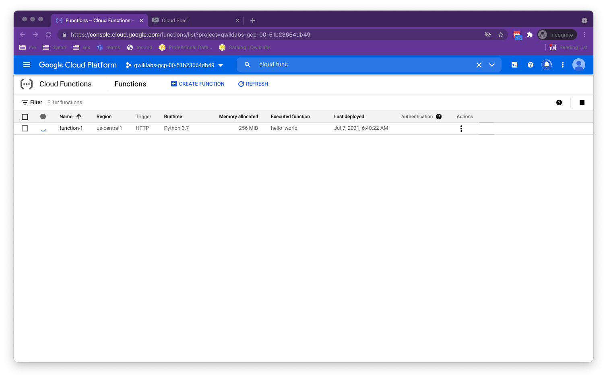
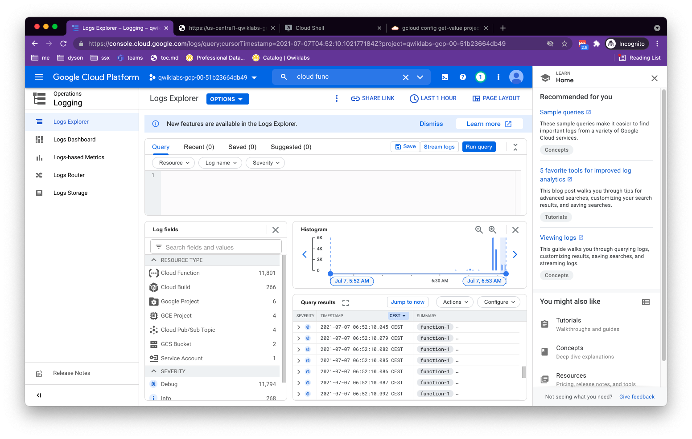
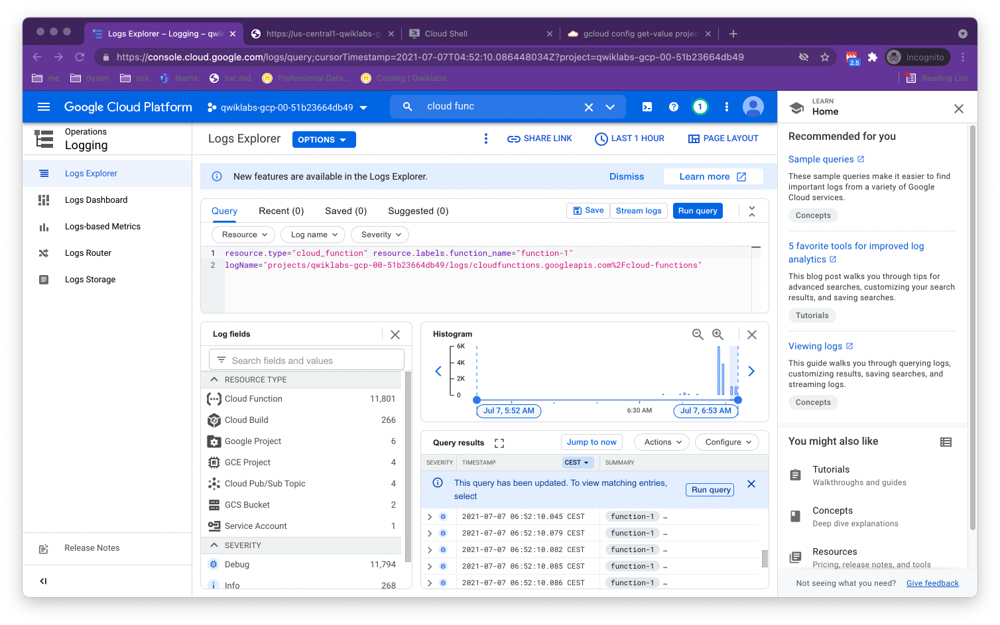
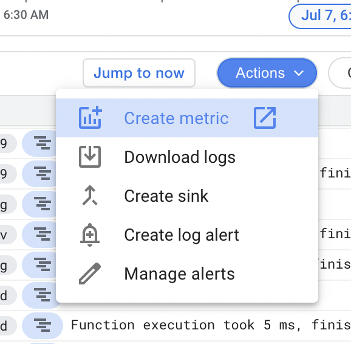
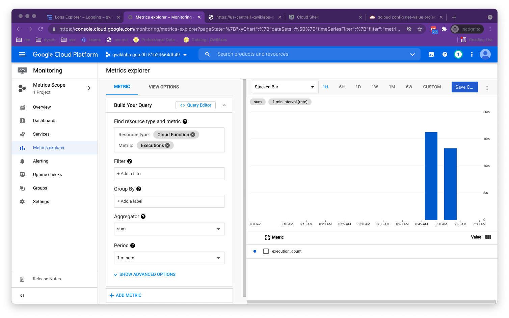
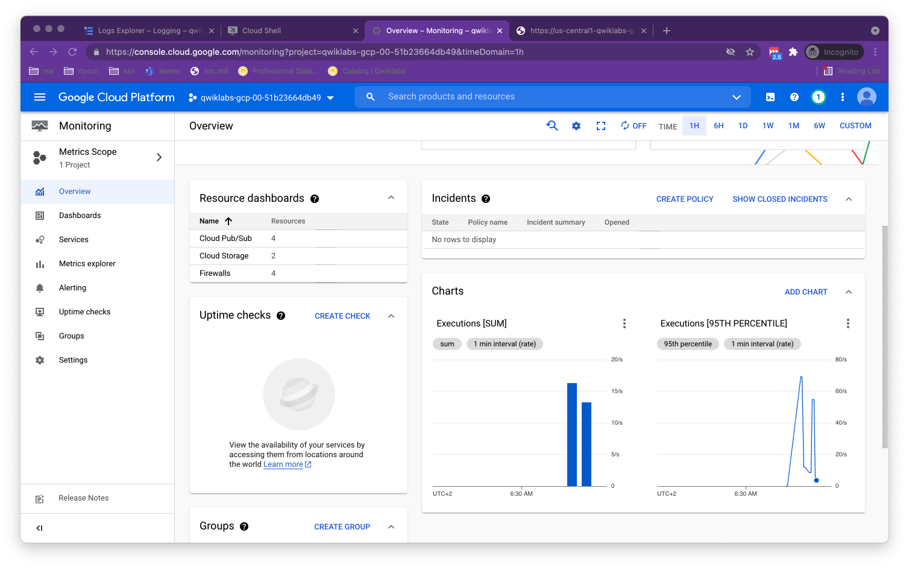

# https:§§google.qwiklabs.com§quests§35
> https://google.qwiklabs.com/quests/35


## Cloud Monitoring: Qwik Start

[https://google.qwiklabs.com/focuses/10599?parent=catalog](/https:§§google.qwiklabs.com§focuses§10599?parent=catalog/readme.md)

## Cloud Monitoring: Qwik Start


## Monitoring Multiple Projects with Cloud Monitoring

## Monitoring and Logging for Cloud Functions

[https://googlecourses.qwiklabs.com/focuses/11617?parent=catalog](/https:§§googlecourses.qwiklabs.com§focuses§11617?parent=catalog/readme.md)

### Setup and requirements

```
qwiklabs-gcp-00-51b23664db49

gcloud auth list

gcloud config list project
```

### Viewing Cloud Function logs & metrics in Cloud monitoring

[https://cloud.google.com/sdk/gcloud](/https:§§cloud.google.com§sdk§gcloud/readme.md)
TODO: doit 



### Test Completed Task

```
wget 'https://github.com/tsenart/vegeta/releases/download/v6.3.0/vegeta-v6.3.0-linux-386.tar.gz'
tar xvzf vegeta-v6.3.0-linux-386.tar.gz

add trigger to CF

export mycf='https://us-central1-qwiklabs-gcp-00-51b23664db49.cloudfunctions.net/function-1'

echo "GET ${mycf}" |./vegeta attack -duration=300s > results.bin &
1954
cat results.bin
kill 1954
```

### Create logs-based metric



select resource and logname


add metric 


### Metrics Explorer



### Create charts on the Monitoring Overview window

add chart to  the chart area



## Reporting Application Metrics into Cloud Monitoring

## Creating and Alerting on Logs-based Metrics

## Autoscaling an Instance Group with Custom Cloud Monitoring Metrics
