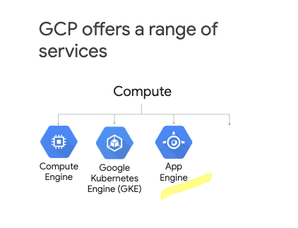
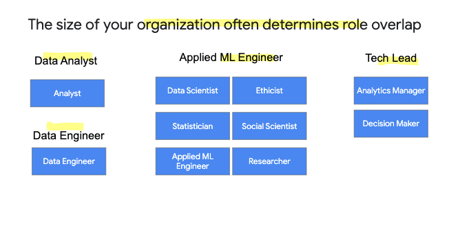

# Introduction to Google Cloud Platform

## Google cloud platfprm

then ml products
ref use case
diff roles in the organization

gooole productus are

they run on 

base laye is security
the next layer is compute, storage and networking
on top, the lat layer is big data and ml

computer power = run compute task in the cloud

moore's law

using tpu as specialized unit
https://cloud.google.com/tpu/

storage =  keep data in the cloud 

use gsutil 
https://cloud.google.com/storage/docs/creating-buckets

4 storage classes

and regional options 

project for managing resources logically

zones and refions physically org gcp resources

folders use under an org

networking  =  petabit bisectional bandwith

google jupiter network enable machine to talk at 10 gbit
https://cloud.google.com/blog/products/bigquery/bigquery-under-the-hood

security  =  iam and other tools
https://cloud.google.com/security/infrastructure/

ex

## big data and ml products

https://research.google/pubs/

2002

gfs to store petabyes of data

2004

m/r to run on commodity hw

2006

retriev streaming info from nosql db

2008

dremel and columnar format
autoscale and parallel the query execution

after 

clossus is ditributed data store
spanner planet scale relational db
pub/sub for msg
tensorflow for ml

final picture with products

compute engine

run vm on the cloud

gke

run containers 
kub to orchestrate code in containers

app engine

run code as pass

cf

servless code execution

use managed storage

gcp services

raw data storage

ingestion

analyze 

ml tools

inisght and serving

## explore use case

https://cloud.google.com/customers/go-jek/X

## roles in org

big data challenges

