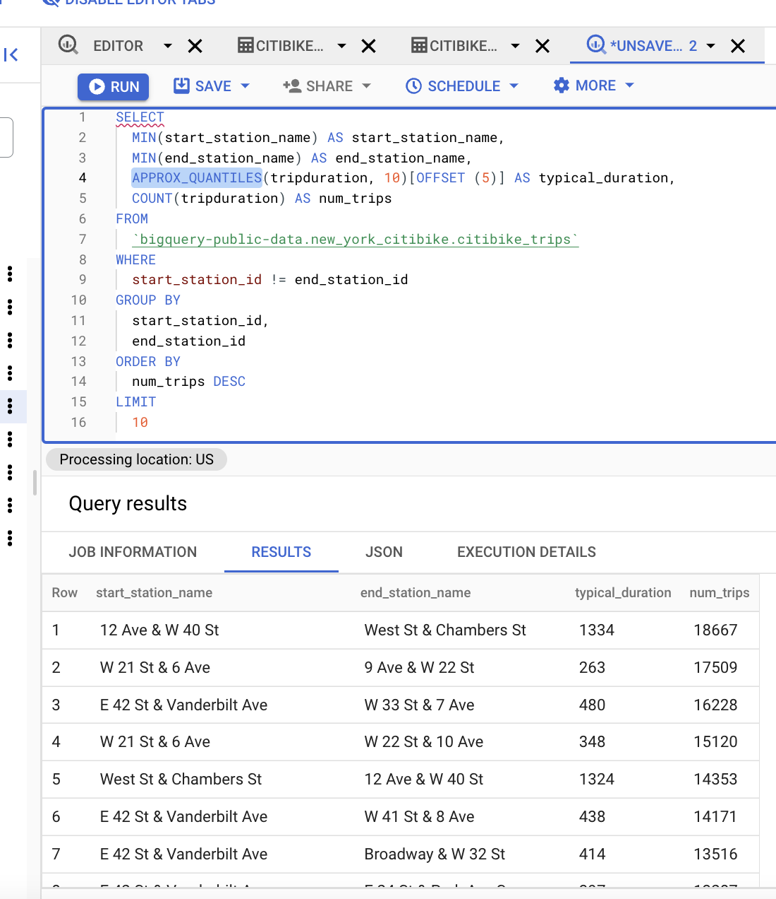
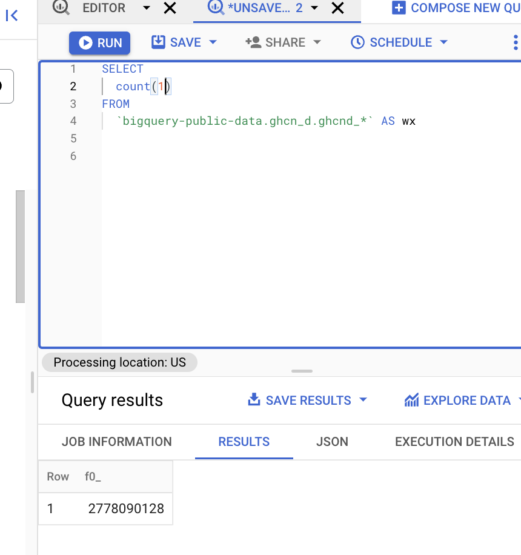

# <https:§§partner.cloudskillsboost.google§course_sessions§221410§labs§61478>
> <https://partner.cloudskillsboost.google/course_sessions/221410/labs/61478>
        
## Using BQ to do analysis

lab on bq

### explore bycicle data

explore public data set


use noaa dataset and renatal bicycle info

[https://console.cloud.google.com/bigquery?p=bigquery-public-data&d=new_york_citibike&t=citibike_trips&page=table&project=qwiklabs-gcp-01-ddfacf47eccd](/https:§§console.cloud.google.com§bigquery?p=bigquery-public-data&d=new_york_citibike&t=citibike_trips&page=table&project=qwiklabs-gcp-01-ddfacf47eccd/readme.md)

> avg usage by station 

```sql
SELECT
  MIN(start_station_name) AS start_station_name,
  MIN(end_station_name) AS end_station_name,
  APPROX_QUANTILES(tripduration, 10)[OFFSET (5)] AS typical_duration,
  COUNT(tripduration) AS num_trips
FROM
  `bigquery-public-data.new_york_citibike.citibike_trips`
WHERE
  start_station_id != end_station_id
GROUP BY
  start_station_id,
  end_station_id
ORDER BY
  num_trips DESC
LIMIT
  10
```



[https://cloud.google.com/bigquery/docs/reference/standard-sql/approximate_aggregate_functions](/https:§§cloud.google.com§bigquery§docs§reference§standard-sql§approximate_aggregate_functions/readme.md)


> total distance travelled by each bicycle in the dataset. Note that the query limits the results to only top 5

```sql
WITH
  trip_distance AS (
SELECT
  bikeid,
  ST_Distance(ST_GeogPoint(s.longitude,
      s.latitude),
    ST_GeogPoint(e.longitude,
      e.latitude)) AS distance
FROM
  `bigquery-public-data.new_york_citibike.citibike_trips`,
  `bigquery-public-data.new_york_citibike.citibike_stations` as s,
  `bigquery-public-data.new_york_citibike.citibike_stations` as e
WHERE
  start_station_id = s.station_id
  AND end_station_id = e.station_id )
SELECT
  bikeid,
  SUM(distance)/1000 AS total_distance
FROM
  trip_distance
GROUP BY
  bikeid
ORDER BY
  total_distance DESC
LIMIT
  5
```

[https://cloud.google.com/bigquery/docs/reference/standard-sql/geography_functions](/https:§§cloud.google.com§bigquery§docs§reference§standard-sql§geography_functions/readme.md)

```sql
SELECT
  wx.date,
  wx.value/10.0 AS prcp
FROM
  `bigquery-public-data.ghcn_d.ghcnd_1` AS wx
WHERE
  id = 'USW00094728'
  AND qflag IS NULL
  AND element = 'PRCP'
ORDER BY
  wx.date
```


correlationn

```sql
WITH bicycle_rentals AS (
  SELECT
    COUNT(starttime) as num_trips,
    EXTRACT(DATE from starttime) as trip_date
  FROM `bigquery-public-data.new_york_citibike.citibike_trips`
  GROUP BY trip_date
),
rainy_days AS
(
SELECT
  date,
  (MAX(prcp) > 5) AS rainy
FROM (
  SELECT
    wx.date AS date,
    IF (wx.element = 'PRCP', wx.value/10, NULL) AS prcp
  FROM
    `bigquery-public-data.ghcn_d.ghcnd_2015` AS wx
  WHERE
    wx.id = 'USW00094728'
)
GROUP BY
  date
)
SELECT
  ROUND(AVG(bk.num_trips)) AS num_trips,
  wx.rainy
FROM bicycle_rentals AS bk
JOIN rainy_days AS wx
ON wx.date = bk.trip_date
GROUP BY wx.rainy
```