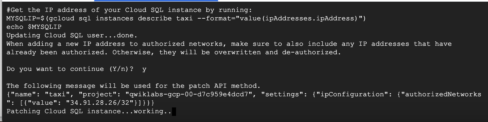
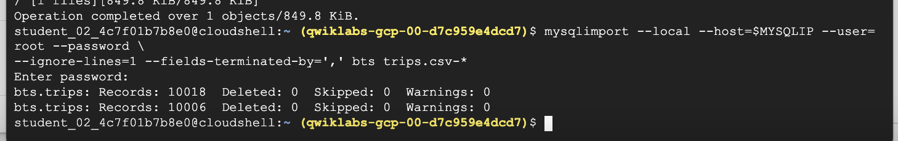

# <https:§§partner.cloudskillsboost.google§course_sessions§221410§labs§61489>
> <https://partner.cloudskillsboost.google/course_sessions/221410/labs/61489>

## Loading Taxi Data into Google Cloud SQL

```bash
gcloud auth list

export PROJECT_ID=$(gcloud info --format='value(config.project)')
export BUCKET=${PROJECT_ID}-ml

```


## Create a Cloud SQL instance

```bash
#create a Cloud SQL instance:
gcloud sql instances create taxi --tier=db-n1-standard-1 --activation-policy=ALWAYS

#Set a root password for the Cloud SQL instance:
gcloud sql users set-password root --host % --instance taxi --password Passw0rd

# ip address
export ADDRESS=$(wget -qO - http://ipecho.net/plain)/32

# Whitelist the Cloud Shell instance for management access to your SQL instance.
gcloud sql instances patch taxi --authorized-networks $ADDRESS

#Get the IP address of your Cloud SQL instance by running:
MYSQLIP=$(gcloud sql instances describe taxi --format="value(ipAddresses.ipAddress)")
echo $MYSQLIP

```


```bash
#create taxi table
mysql --host=$MYSQLIP --user=root --password --verbose
# When prompted for a password enter Passw0rd
```
use 

```sql
create database if not exists bts;
use bts;
drop table if exists trips;
create table trips (
  vendor_id VARCHAR(16),		
  pickup_datetime DATETIME,
  dropoff_datetime DATETIME,
  passenger_count INT,
  trip_distance FLOAT,
  rate_code VARCHAR(16),
  store_and_fwd_flag VARCHAR(16),
  payment_type VARCHAR(16),
  fare_amount FLOAT,
  extra FLOAT,
  mta_tax FLOAT,
  tip_amount FLOAT,
  tolls_amount FLOAT,
  imp_surcharge FLOAT,
  total_amount FLOAT,
  pickup_location_id VARCHAR(16),
  dropoff_location_id VARCHAR(16)
);

-- some sql
describe trips;
select distinct(pickup_location_id) from trips;

```

tools > 
http://ipecho.net/plain
for ip

## Add data to Cloud SQL instance
```bash

#copy from samples
gsutil cp gs://cloud-training/OCBL013/nyc_tlc_yellow_trips_2018_subset_1.csv trips.csv-1
gsutil cp gs://cloud-training/OCBL013/nyc_tlc_yellow_trips_2018_subset_2.csv trips.csv-2

# Import the CSV file data into Cloud SQL using mysql:
mysqlimport --local --host=$MYSQLIP --user=root --password --ignore-lines=1 --fields-terminated-by=',' bts trips.csv-*

```



