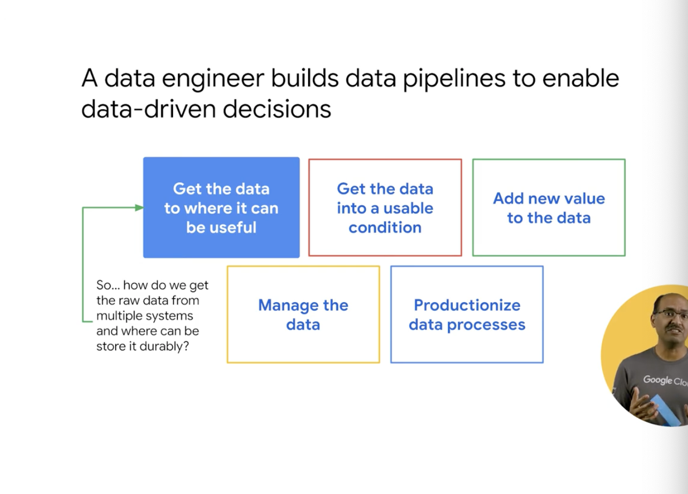

# <https:§§partner.cloudskillsboost.google§course_sessions§221410§video§61465>
> <https://partner.cloudskillsboost.google/course_sessions/221410/video/61465>
        
## Explore the role of a data engineer
       

build data pipelines on gcp
what you enable in the org writing proper pipelines
check reference architecture


build pipelien to dashboard 
where data driven decision can be taken
need to tranform raw data into usable ones


data from diff places and store raw data in datalake
ex 
gcs bucket


handle all the types of data
elastically scale on demand
support high throughout ingestion
fine grained access control to the objects
easy to connect to access to data
datalake = data accessable for anlytics


gcs for archival and storage
```
gsutil mb gs://uniq-name
```


transfor the data from org form in batch
use dataproc ot dataflow


in case of streaming
use of pub/sub dataflow and bq


