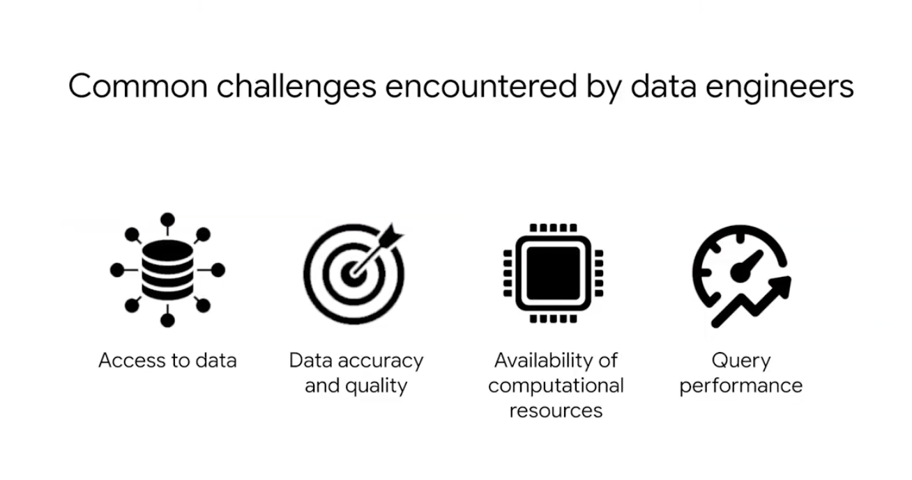
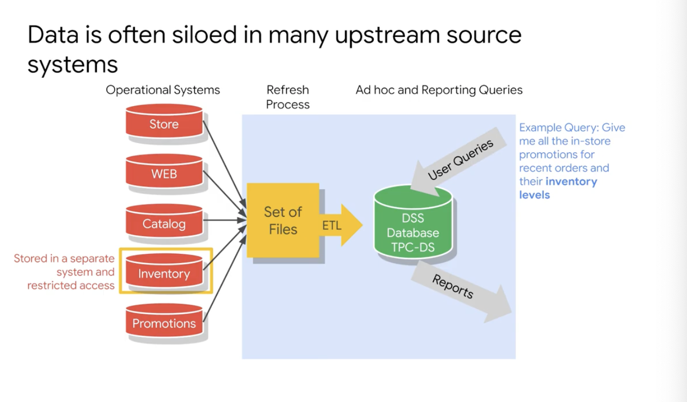
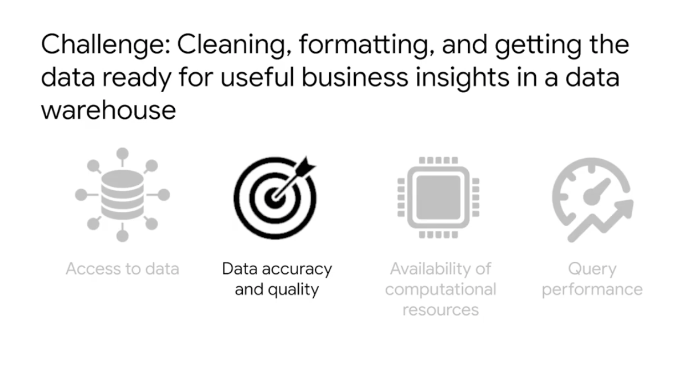
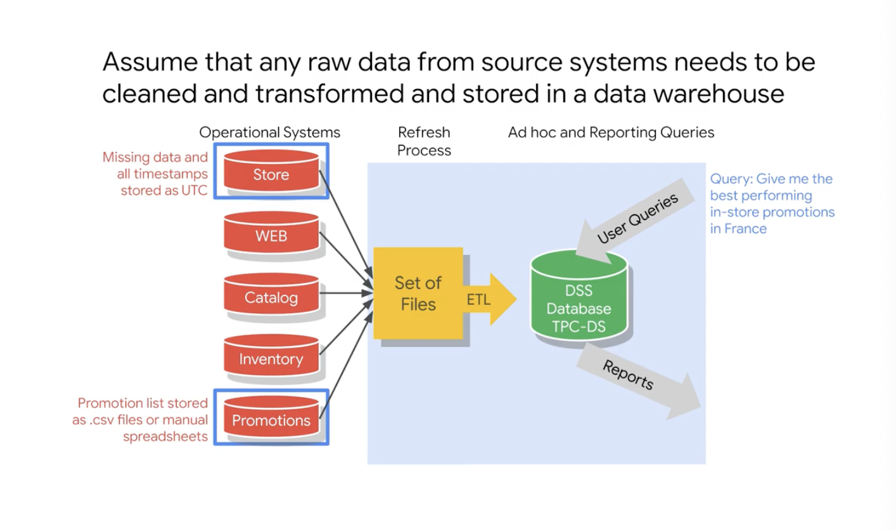
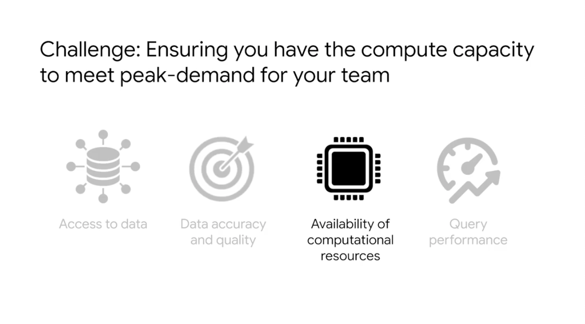
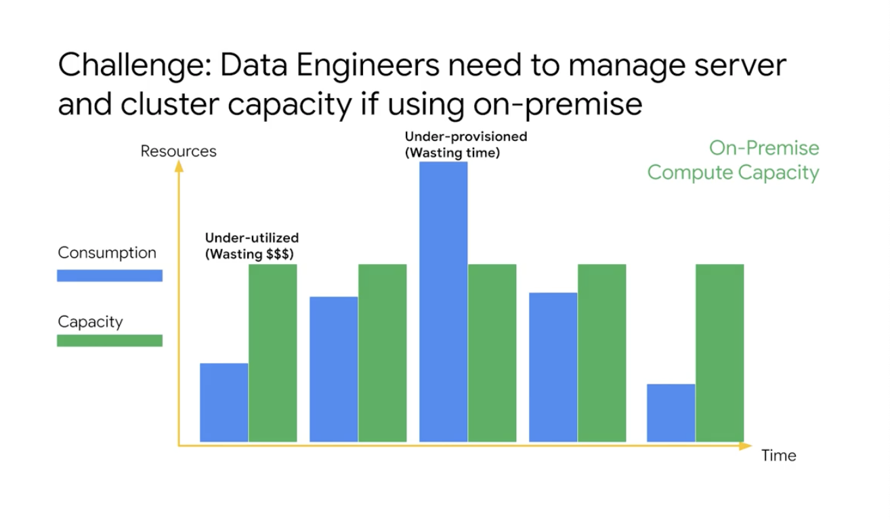
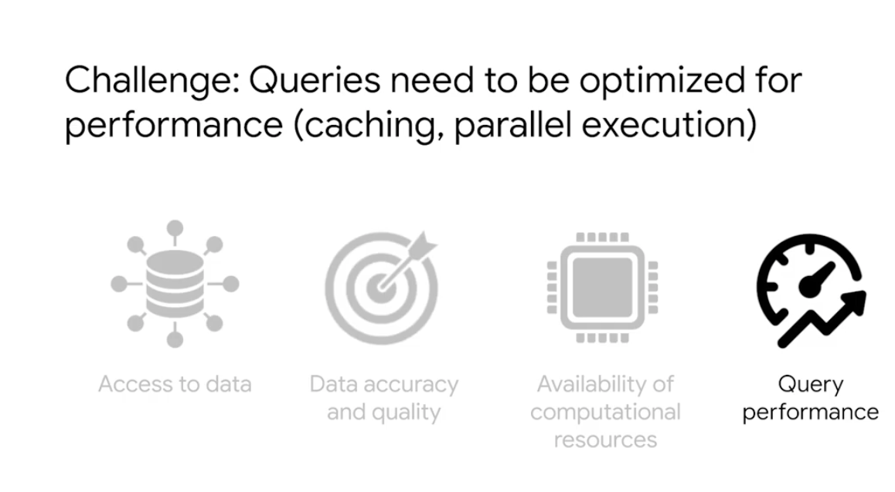
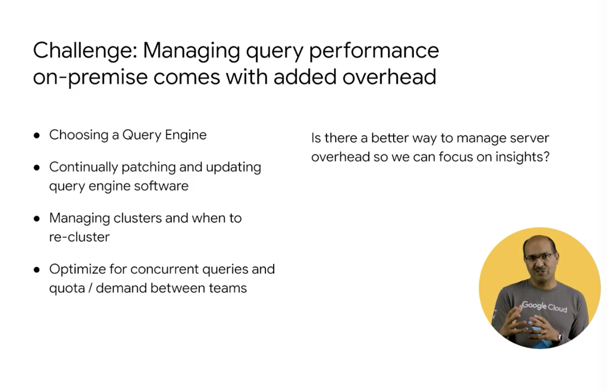

# <https:§§partner.cloudskillsboost.google§course_sessions§221410§video§61466>
> <https://partner.cloudskillsboost.google/course_sessions/221410/video/61466>
        

## Analyze data engineering challenges

access the data but missing quality
data scattered in variety of sources

data siloed in operational systems

etl pipelines needed for quality
edw consolidated place but the data is easily joinable
data lake is in raw format

assume raw data had to ble cleaned and tranformed
transform in an efficient format

common problems is where do I compute that

on premise isues with compute needed
computer power is not constant
low traffic => waste money
traffic high => jobs take more time 

choose query engine 
privisiong servers big overhead

