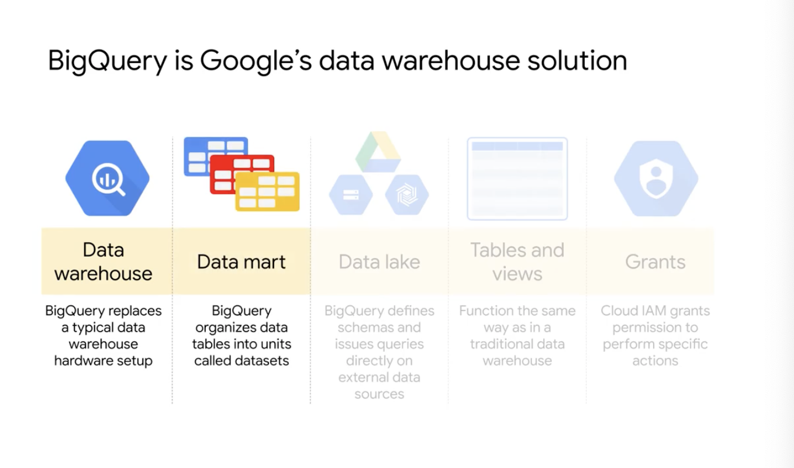
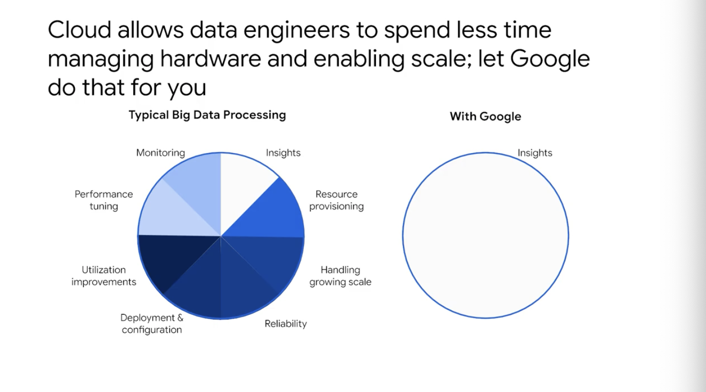
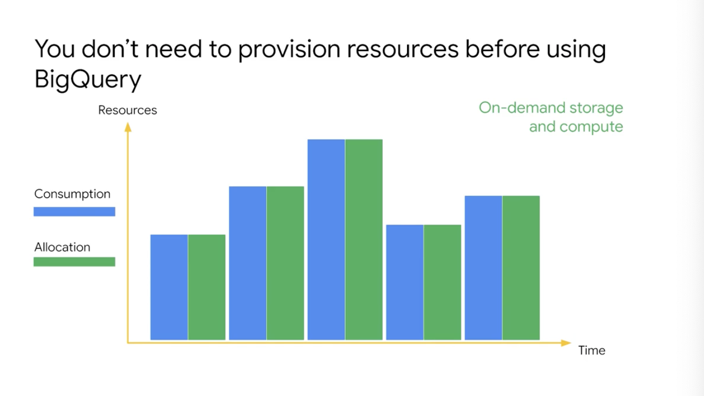

# <https:§§partner.cloudskillsboost.google§course_sessions§221410§video§61467>
> <https://partner.cloudskillsboost.google/course_sessions/221410/video/61467>
        
## Intro to BigQuery

serveless dwh petabyte scale

dwh and datamart
tight to  gcp prj
datalake not normalized
you can run federated queries
tbl and views as traditional dwh in anqsi/sql
grant in iam instead of grant and revoke

more with less
spend time in getting insight

bq allocate storage and query dynamically based on usage pattern
each query use slots
slot = unit of computation
