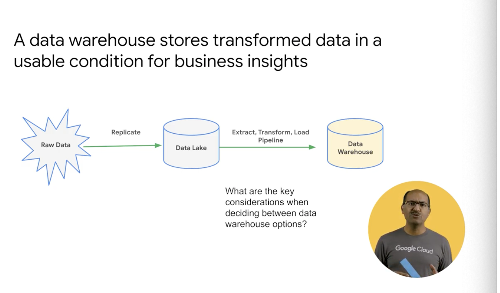
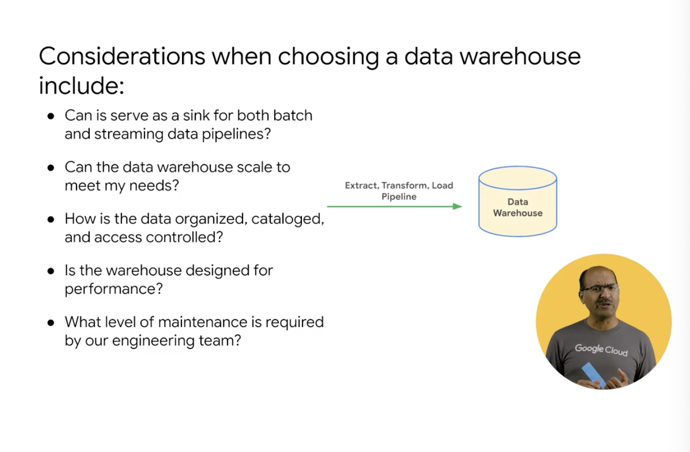
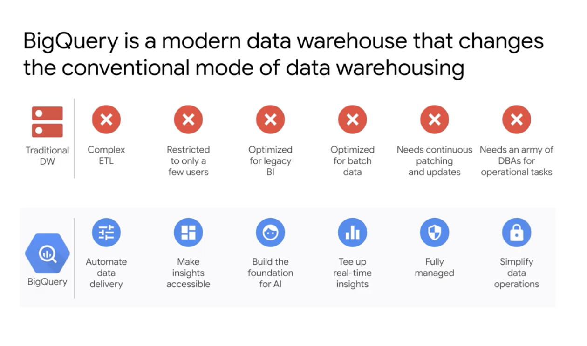
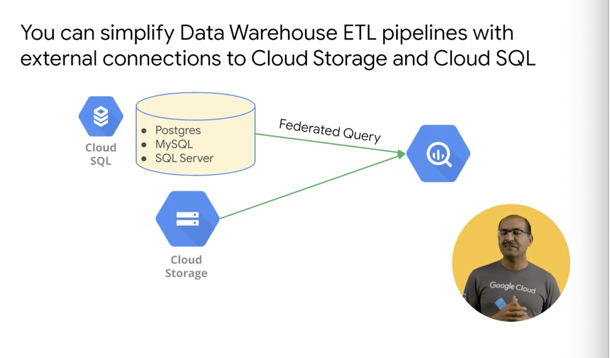

# <https:§§partner.cloudskillsboost.google§course_sessions§221410§video§61468>
> <https://partner.cloudskillsboost.google/course_sessions/221410/video/61468>
        
## Data Lakes and Data Warehouses

data eng need to make data into usable condition (useful)

store usable data in dwh

ask these:
- batch or streaming feeding
- dwh will scale
- how data organzied/catalogue/access 
- designed for concurr query performance

- automate data transf
- create read only shared data sources
- build ai foundation in bq ml or gis data
- real time inights
- fully managed by gcp
- iam makes roles and groups and bkp and replication

use bq only as query engine and query data in the datalake
leave data in place and join other data in dwh
