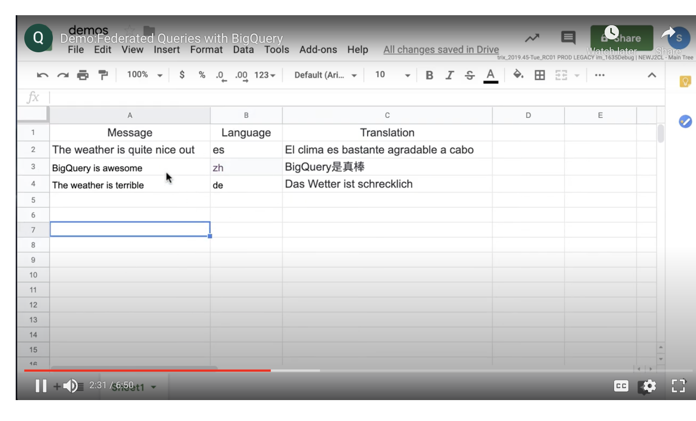
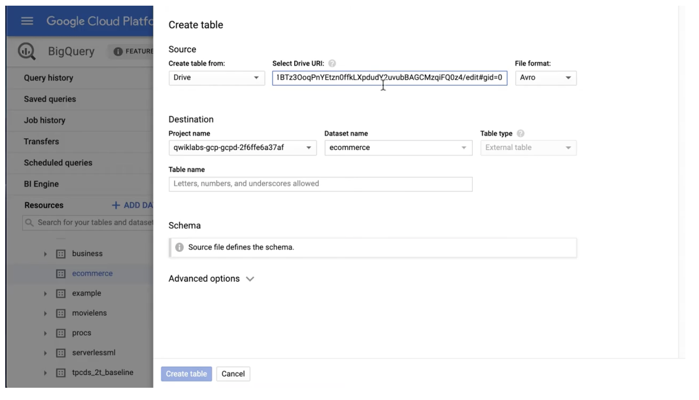
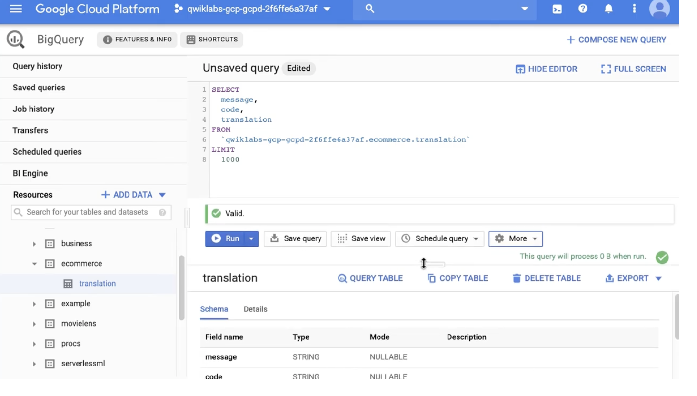

# <https:§§partner.cloudskillsboost.google§course_sessions§221410§video§61469>
> <https://partner.cloudskillsboost.google/course_sessions/221410/video/61469>

## Demo:Federated Queries with BigQuery

use this 
[https://github.com/GoogleCloudPlatform/training-data-analyst/tree/master/courses/data-engineering/demos](/https:§§github.com§GoogleCloudPlatform§training-data-analyst§tree§master§courses§data-engineering§demos/readme.md)

thi sample
[https://github.com/GoogleCloudPlatform/training-data-analyst/blob/master/courses/data-engineering/demos/simple_external_data_query.md](/https:§§github.com§GoogleCloudPlatform§training-data-analyst§blob§master§courses§data-engineering§demos§simple_external_data_query.md/readme.md)




this as source



provide schema as text

```
message:STRING,
code:STRING,
translation:STRING
````


click on table name 


