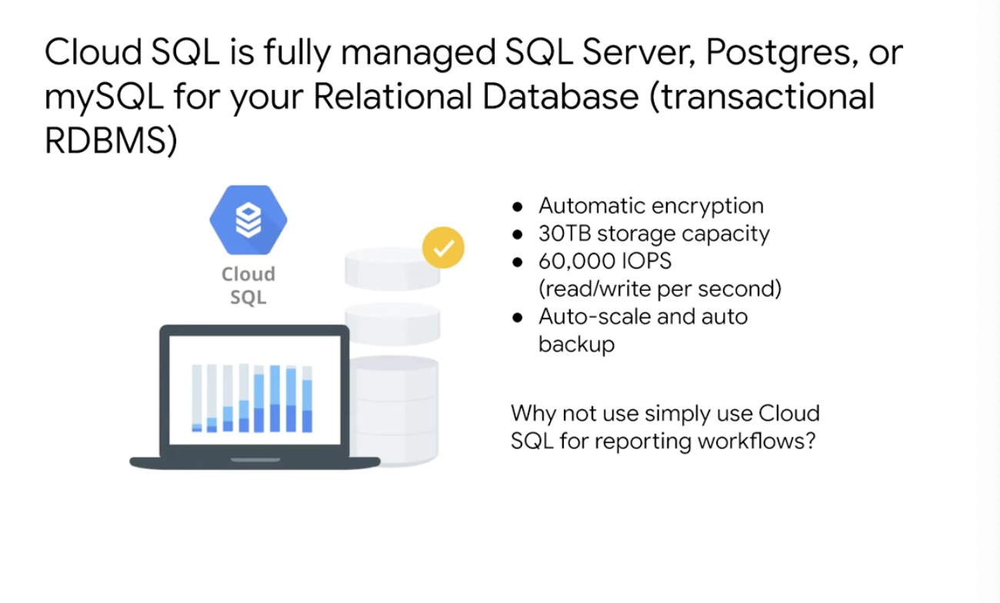
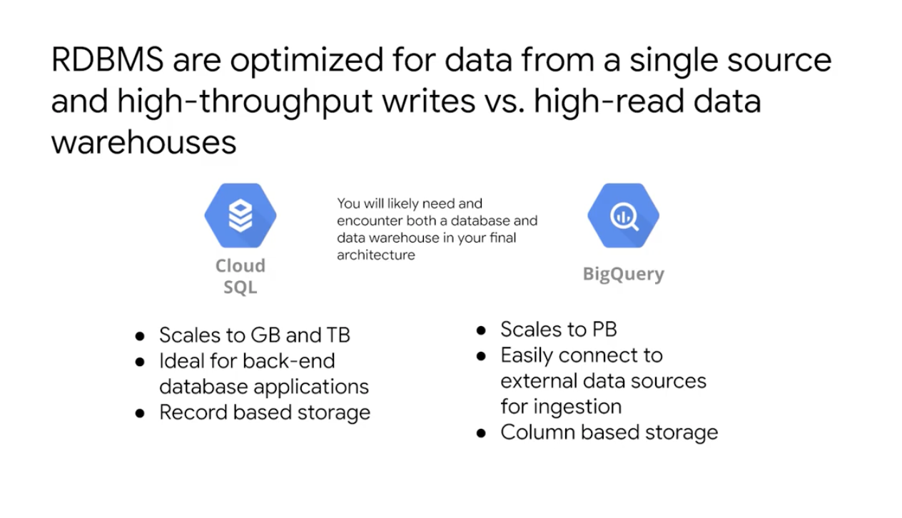
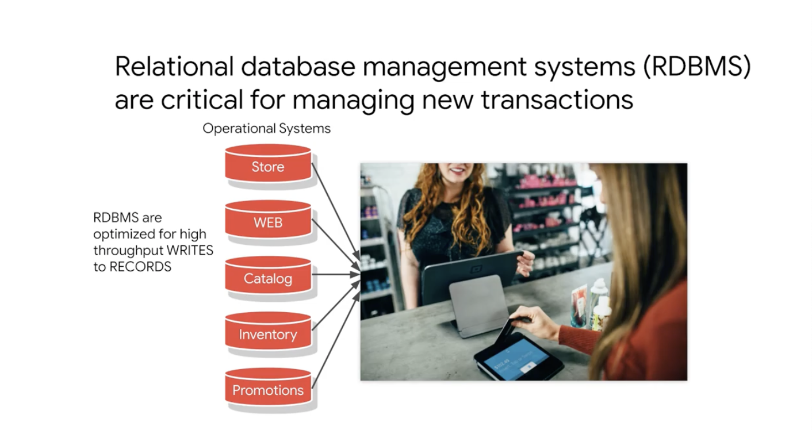
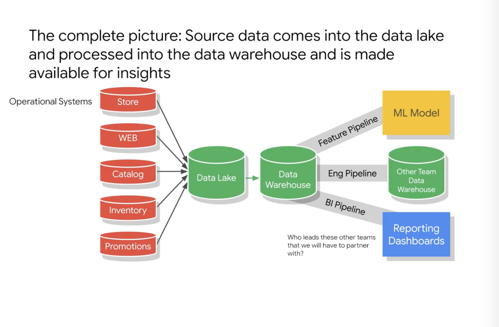

# <https:§§partner.cloudskillsboost.google§course_sessions§221410§video§61470
>
> <https://partner.cloudskillsboost.google/course_sessions/221410/video/61470
>

## Transactional Databases vs Data Warehouses

clsql 30 tb of storage
auto scale and auto bkp

opt for transaction
bq for read adnd reporting 
bq is column based storage

manage transactions

raw data from operational sources
upstream gathered into a datalake
datalake for durability and high availabilty
data need to be processed into dwh
multiple team use dwh data in diff ways

