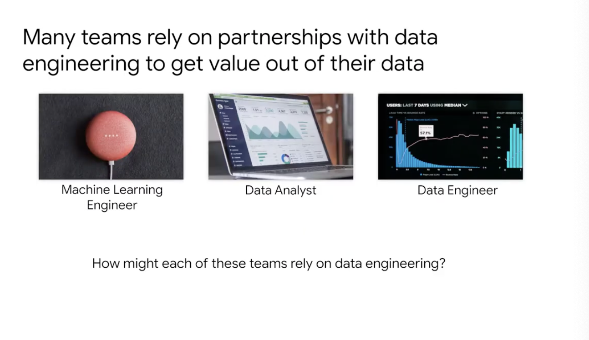
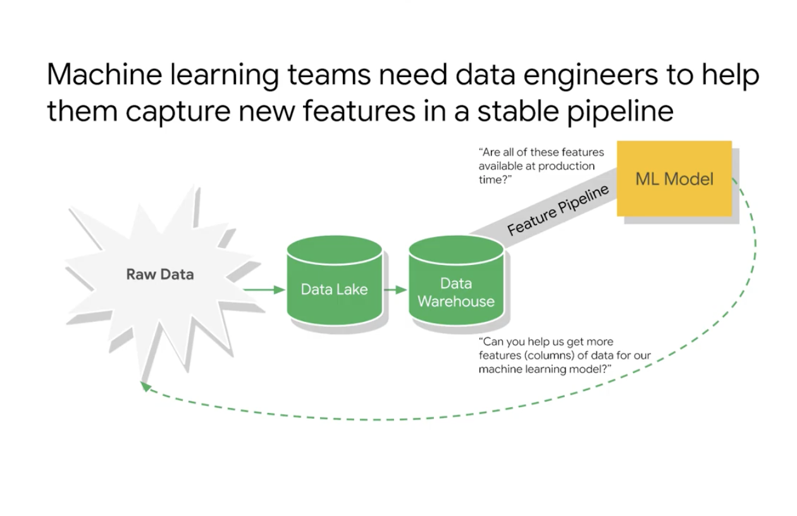
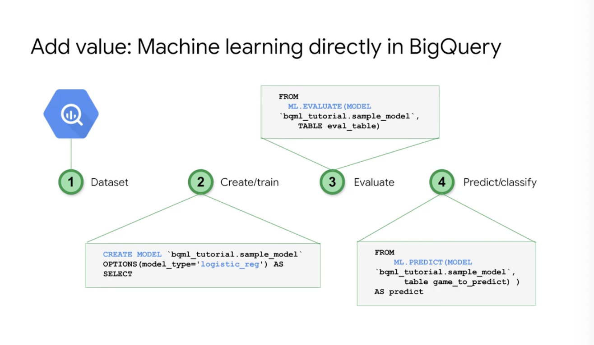
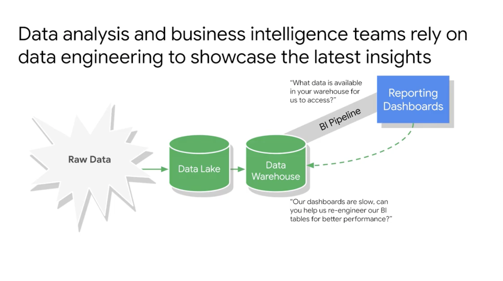
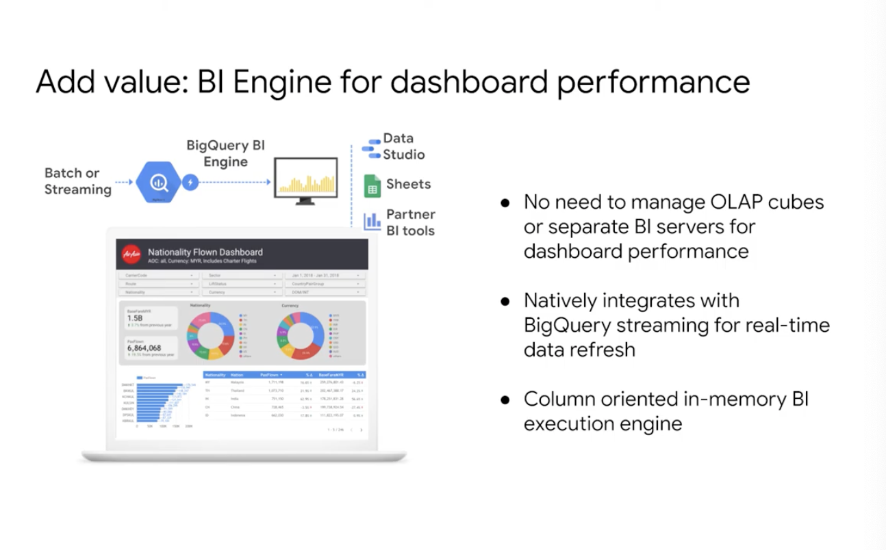
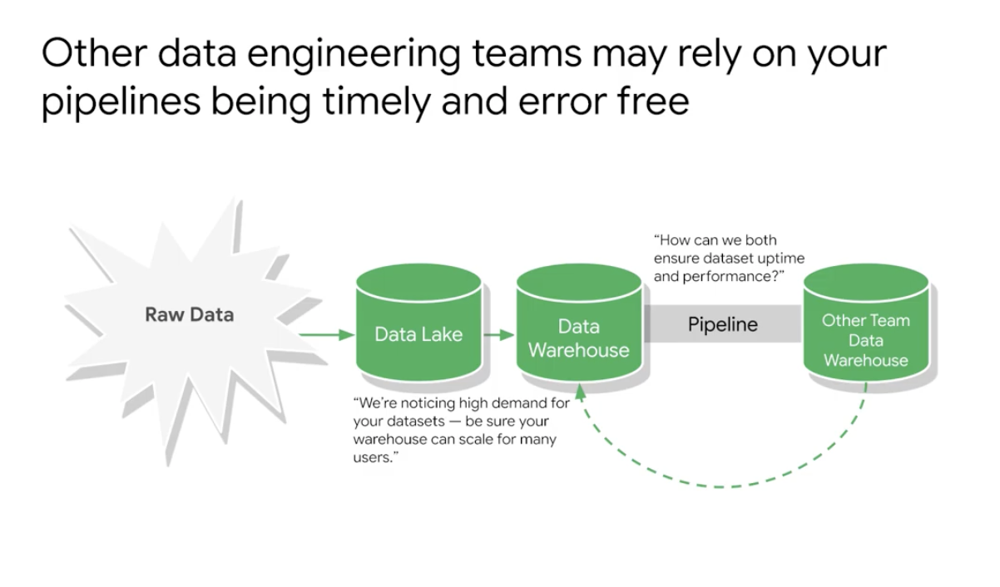
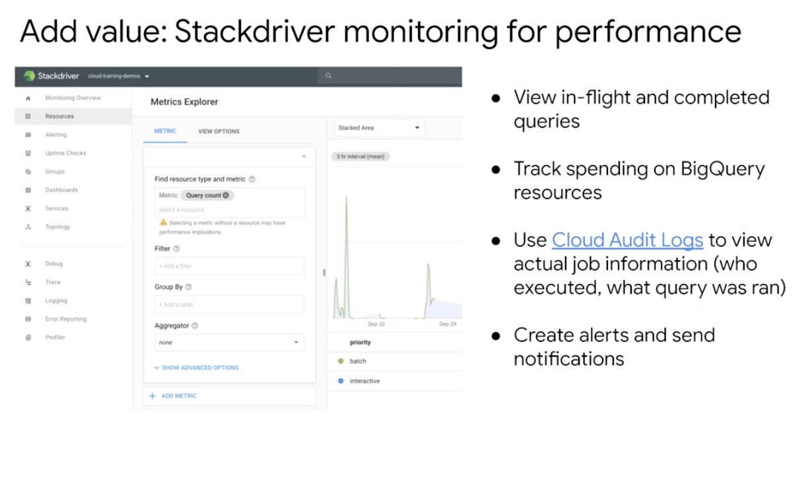

# <https:§§partner.cloudskillsboost.google§course_sessions§221410§video§61471>
> <https://partner.cloudskillsboost.google/course_sessions/221410/video/61471>

## Partner effectively with other data teams

how to provide access tod dwh
need of data governace

examine each role how they intercat with the dwh

ml needs data to train their model

you can create ml in bq

BI or data anlyst
need to query data

BI engine
fast in mem analysis service to speed up bi app
[https://cloud.google.com/bigquery/docs/bi-engine-intro](/https:§§cloud.google.com§bigquery§docs§bi-engine-intro/readme.md)

other data eng needs your dwh for their data pipelines

monitor the ecosystem using stackdriver so metrics can be checked for usage and performance
