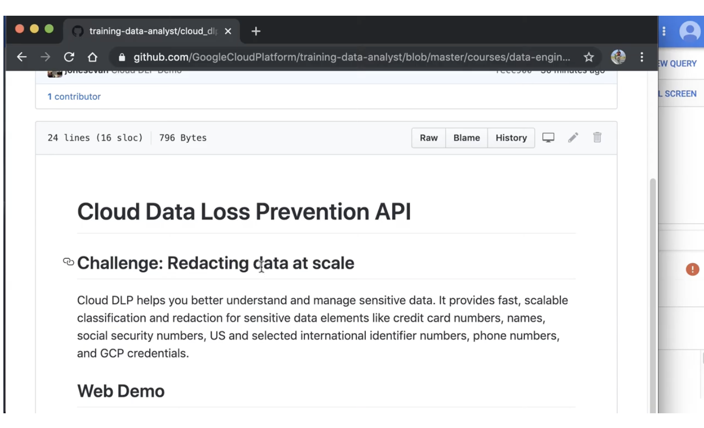

# <https:§§partner.cloudskillsboost.google§course_sessions§221410§video§61473>
> <https://partner.cloudskillsboost.google/course_sessions/221410/video/61473>
        
## Demo:Finding PII in your dataset with DLP API

[https://github.com/GoogleCloudPlatform/training-data-analyst/blob/master/courses/data-engineering/demos/cloud_dlp.md](/https:§§github.com§GoogleCloudPlatform§training-data-analyst§blob§master§courses§data-engineering§demos§cloud_dlp.md/readme.md)

[https://cloud.google.com/dlp/demo/#!/](/https:§§cloud.google.com§dlp§demo§#!§/readme.md)

what it can do on text
