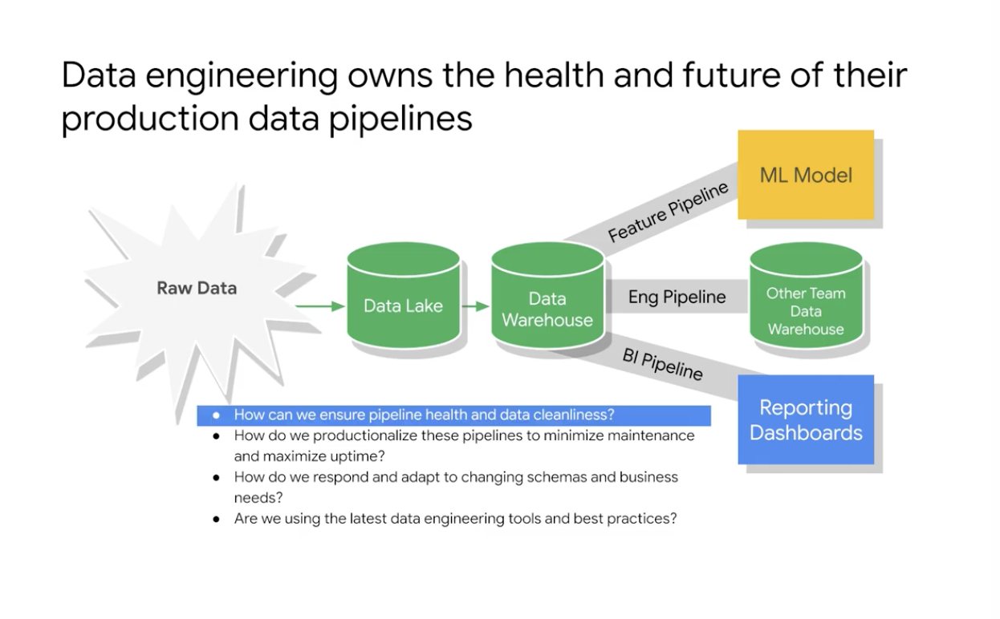
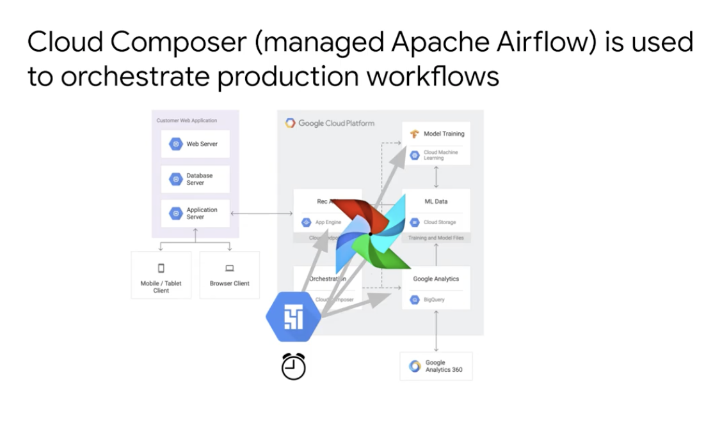

# <https:§§partner.cloudskillsboost.google§course_sessions§221410§video§61474>
> <https://partner.cloudskillsboost.google/course_sessions/221410/video/61474>
        
## Build production-ready pipelines

- ensure health
- adapt to changes

composeer is managed version of airflow
to orch the data pipelines
