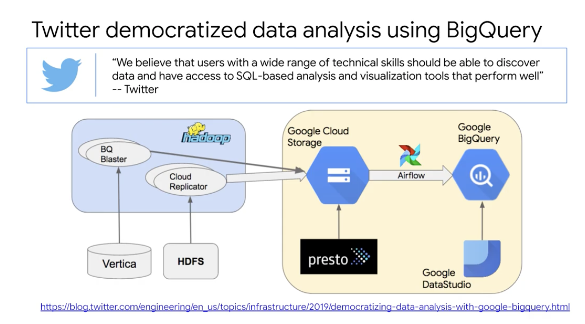

# <https:§§partner.cloudskillsboost.google§course_sessions§221410§video§61475>
> <https://partner.cloudskillsboost.google/course_sessions/221410/video/61475>
        
## Review GCP customer case study

ocado customer service receive a lot of message

use ml to find the high priority so they can be processed

ml using language 

twitter 
replicate some data from hadoop into cl and bq so iut can be used
