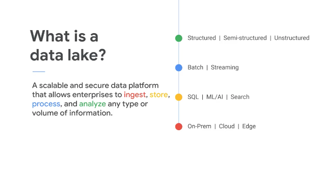
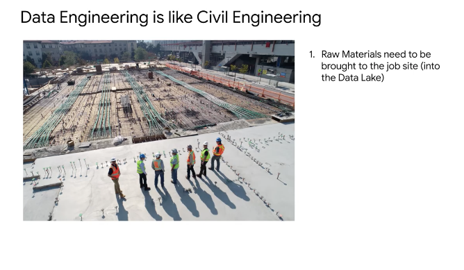
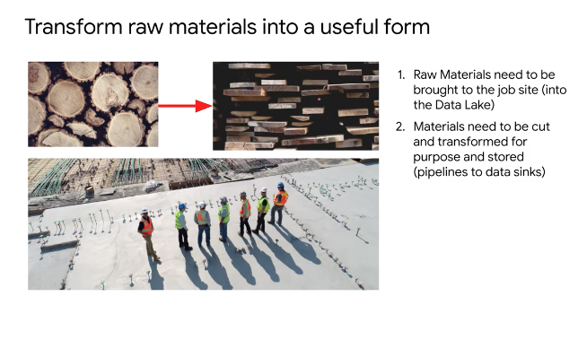
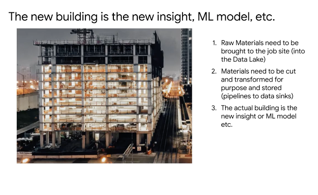
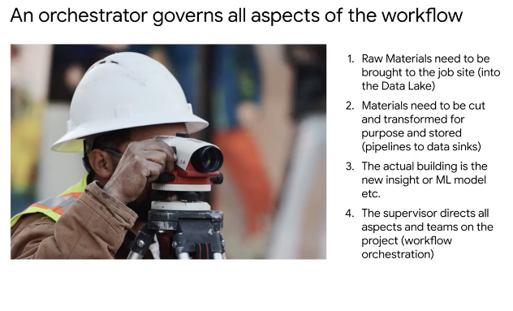
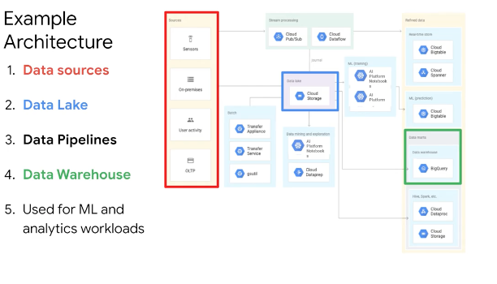
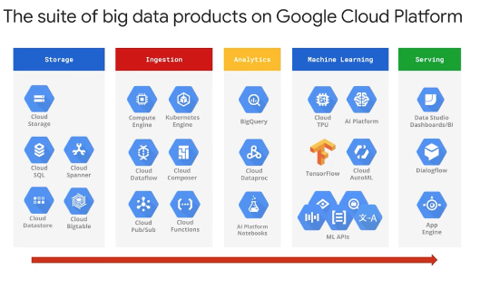
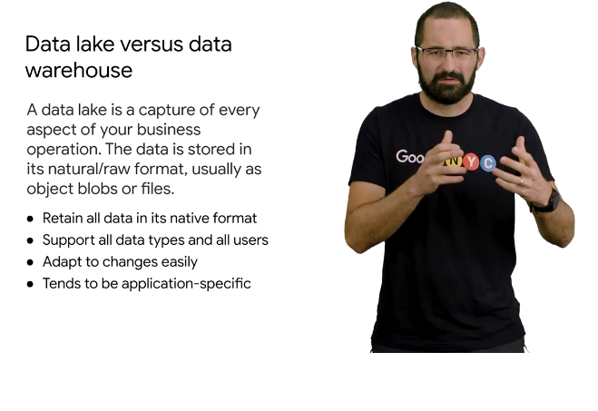
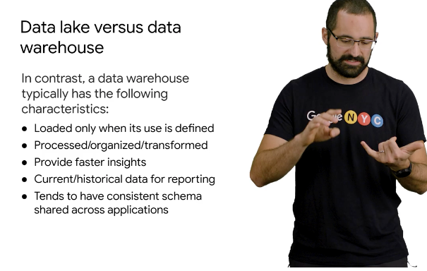

# <https:§§partner.cloudskillsboost.google§course_sessions§221410§video§61479>
> <https://partner.cloudskillsboost.google/course_sessions/221410/video/61479>

## Introduction to Data Lakes

place where to secure various type of data for processing
all types of data are accepted
we can define a central data lake repository

to build the skycraper
raw material are needed you bring on the construction site
> bring the data

raw material need to be transformed 
> format the data to be valuable

end goal is the building
> ml model, reports

director on the site to coordinate
> composer/orchestration layer

data lake = bucket
not the only one 

in this module cloud storage and cloud sql

data in aw format vs business format

def use case defined
no garbage in
