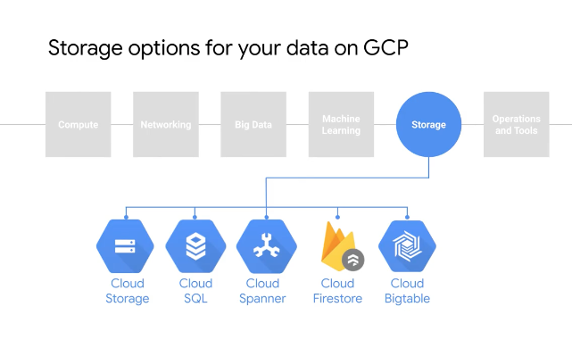
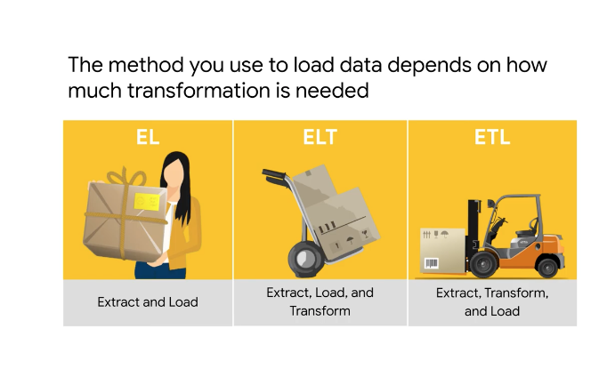

# <https:§§partner.cloudskillsboost.google§course_sessions§221410§video§61480>
> <https://partner.cloudskillsboost.google/course_sessions/221410/video/61480>

## Data Storage and ETL options on GCP

focus clstorage and cloud sql

which one to choose
- where data is data now
- 3V
- where it has to go

commond data sink is dwh

el =  extract and load
> ex
avro files loaded by bq
data imported as it is in a system
bq can run on federated queries

elt =  extrat load and transform
data need to be cleanup
data need to be tranformed
amount of data not very high
data after transf same size of imput
> ex
inside bq transform data into a new table

etl = data integartion process
common when after tramsformation reduce the size
need to huge conversionn of initial data
> ex
datapipeline before loaded in bq

