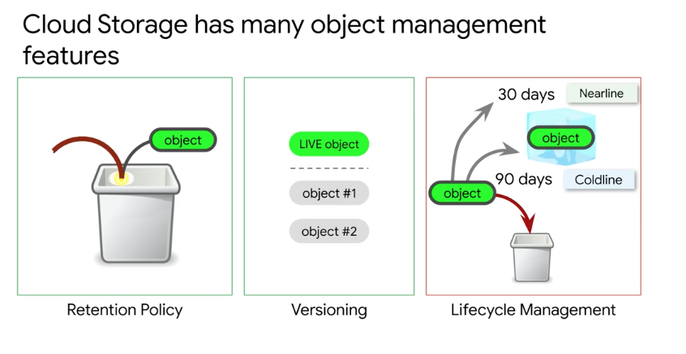

# <https:§§partner.cloudskillsboost.google§course_sessions§221410§video§61481>
> <https://partner.cloudskillsboost.google/course_sessions/221410/video/61481>
        
## Building a Data Lake using Cloud Storage


persistent
inexpensive
save the state in app and shoutdwon computation
object store
binary objects
data in encrypted
global service but data kept in single region if needed


object storage with features
objects = individual data
buckets = contain objects
namespace is uniq globally
bucket is associated with region/multiple region
save network egress charge
replica is done automatically 9s
in multi-region objects are replicated across regions 
in single region  objects are replicates across zones within a region


choose location carefully
single region
> europe-north-1
> asia-south-1
dual-region
> north-america-4 (in us-central-1 and us-east-1)
multi region
> eu or asia

data in a region replicated in multiple zones in that region
single zone goes down replcaited data is read
a flood in a region can be recovered from other region (dual region at least)


storage classes:
normal nearline and coldline


bucket name+objecty name 

```
gs://xxx/yy/file.txt
[https://storage.cloud.google.com/xxx/yy/file.txt](/https:§§storage.cloud.google.com§xxx§yy§file.txt/readme.md)
```
you cannot move files from dir to another dir
there is no actual directory structure
it need to lookup in the full name in the bucket to find the matching 

use gstuil tool
use https to copy the data in the web


retention policy of the objects
define life-cycle management
