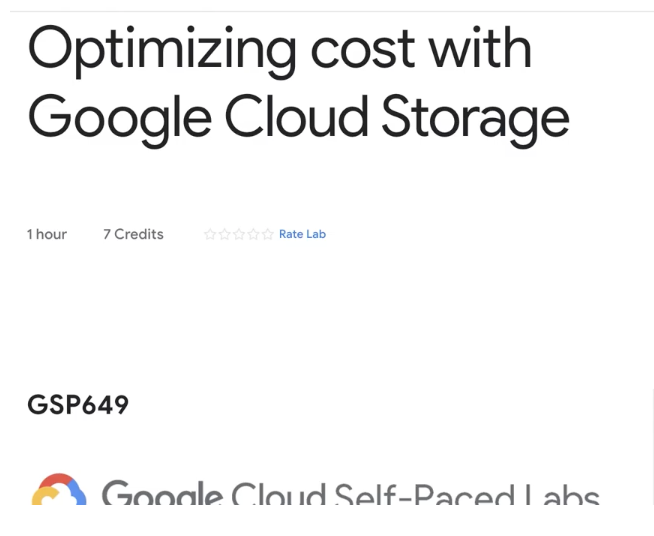
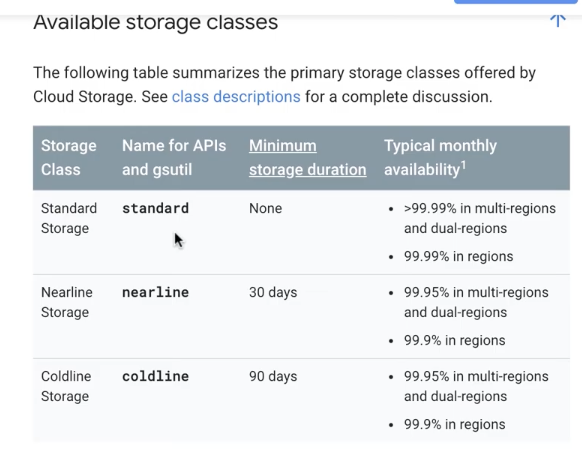
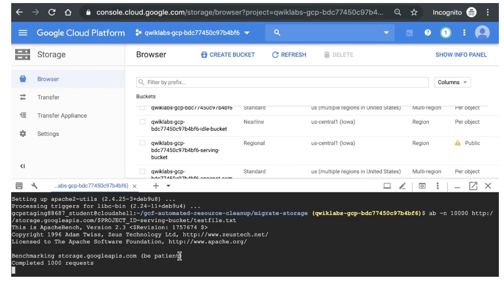

# <https:§§partner.cloudskillsboost.google§course_sessions§221410§video§61482>
> <https://partner.cloudskillsboost.google/course_sessions/221410/video/61482>

## Demo:Optimizing cost with Google Cloud Storage classes and Cloud Functions

move object from nearline (once a day max)

use stackdriver to monitor

use ab lib to call the object automatically

