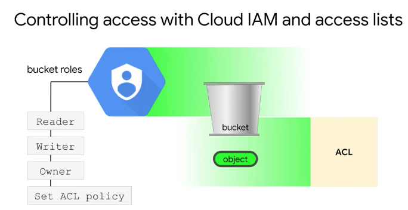
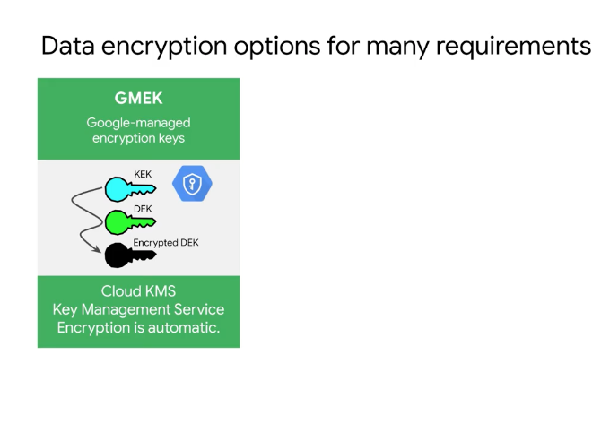
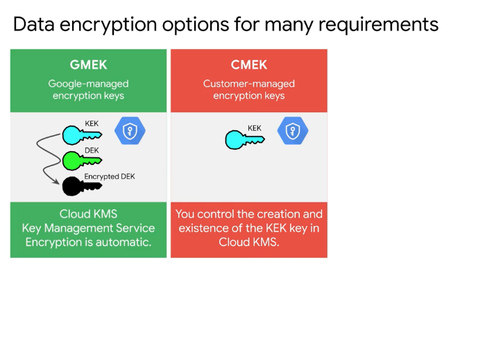
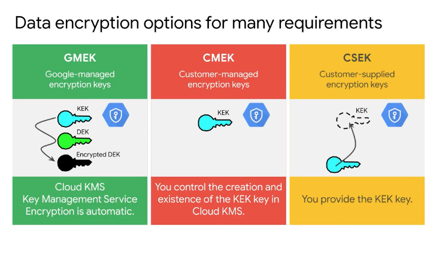
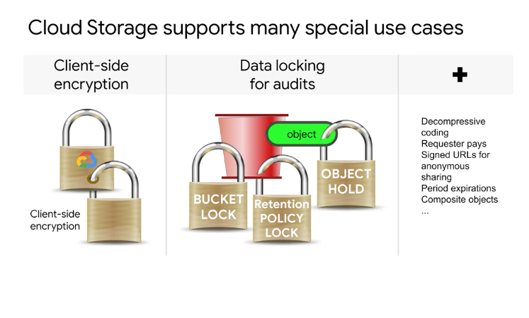

# <https:§§partner.cloudskillsboost.google§course_sessions§221410§video§61483>
> <https://partner.cloudskillsboost.google/course_sessions/221410/video/61483>

2 way
cloud iam policy  + access control list (acls) 
cloud iam set at bucket level
acls set at finer grade

cloud iam provides
- cloud bucket reader
- cloud bucket writer
- cloud bucket owner
enable/disable acl policy

data is encryoted at rest and on transict
via encryptin  keys
2 leveles
- data encrypted
- data encrypter itlsef via keys

TODO: add docs

automatically by gcp

you have to manager the keys and rotate them

you manage all via csek

you encrypt data before uploaded

you can tag object to amange gzip autmaticaly
you pay if data is requessted from diff region (egress costs)
you can define s asigned url
