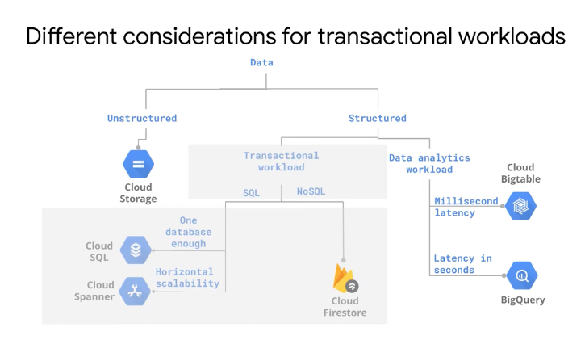
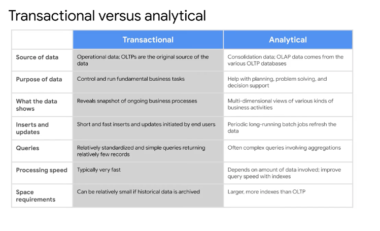
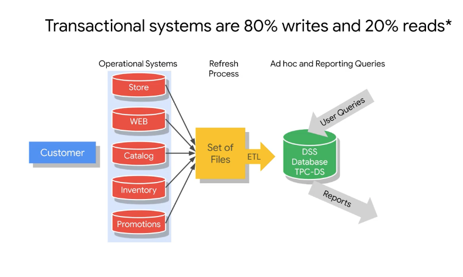
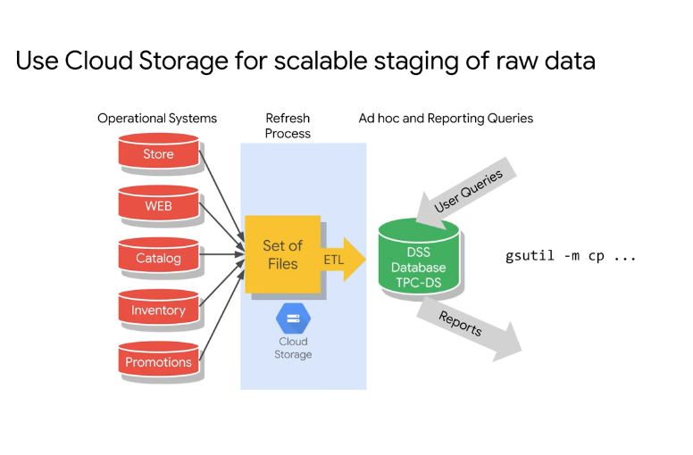
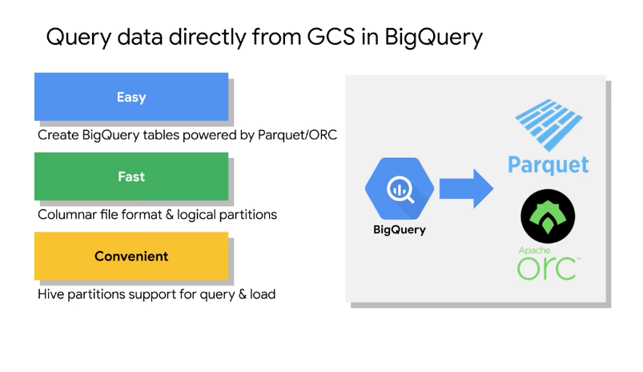

# <https:§§partner.cloudskillsboost.google§course_sessions§221410§video§61484>
> <https://partner.cloudskillsboost.google/course_sessions/221410/video/61484>

cl storage not for frequesnt updates
for unstructered data analytis use big table

oltp =  transactions/atomic/write
olap =  report/aggregated/read

operational sys =  freq data changes
refrsh process = grab data 
olap =  read focused
data eng build pipelines

el = extract dat from oltp and load in bq

stage data in gs to stage data
load from gs to bq then

query data from bq using federated queries
data stay in gs and not loaded in bq internal storage

