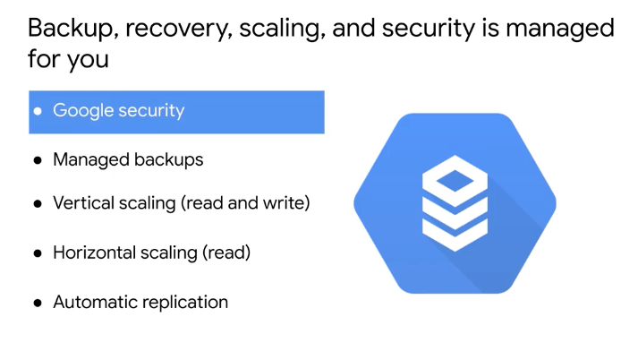

# <https:§§partner.cloudskillsboost.google§course_sessions§221410§video§61487>
> <https://partner.cloudskillsboost.google/course_sessions/221410/video/61487>

sql managed service for 3rd party sql

compute engine with db engine installed
do bkp/updates
99.95 availability

access cloud sql instance in the same zone of the vm

benefits

fail over replicate in another zone in the same region
replica become the master
new failover created in another zone
possible to revert back when zone is restored

fully managed =  runs on  some vms
servless =  next step  as api you call

