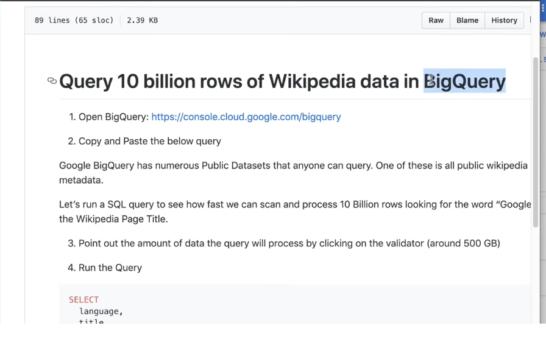
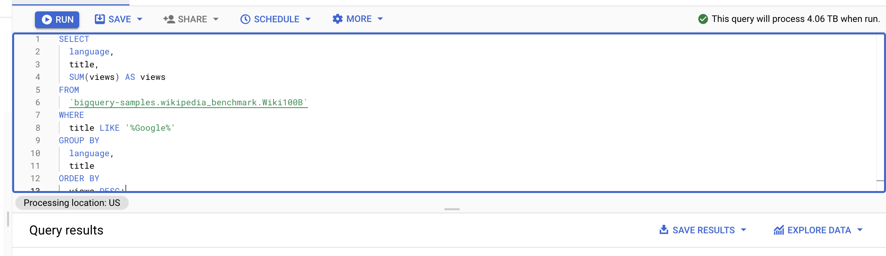
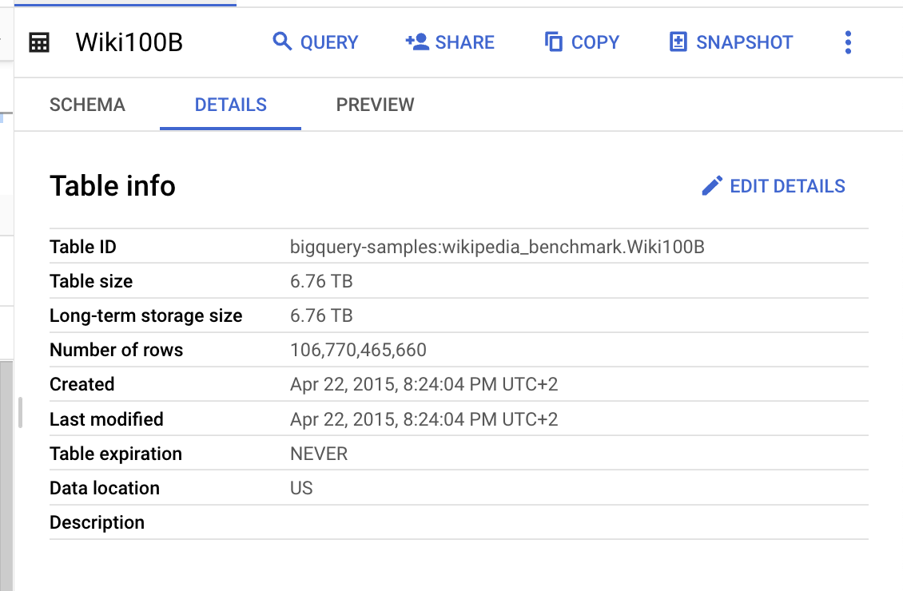
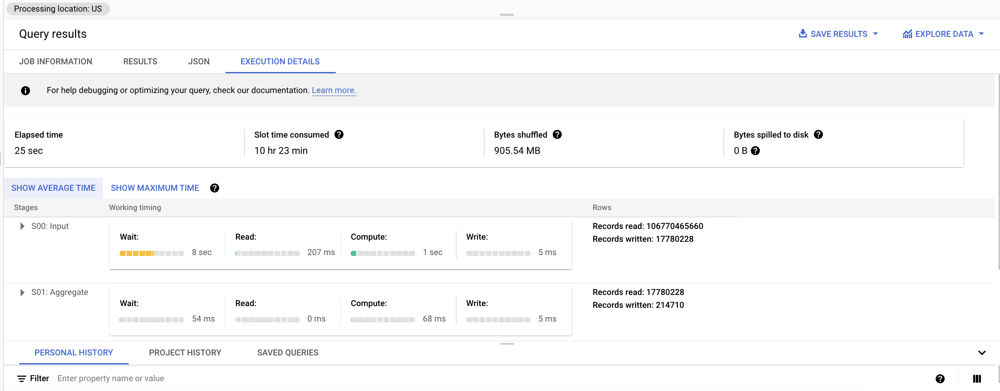
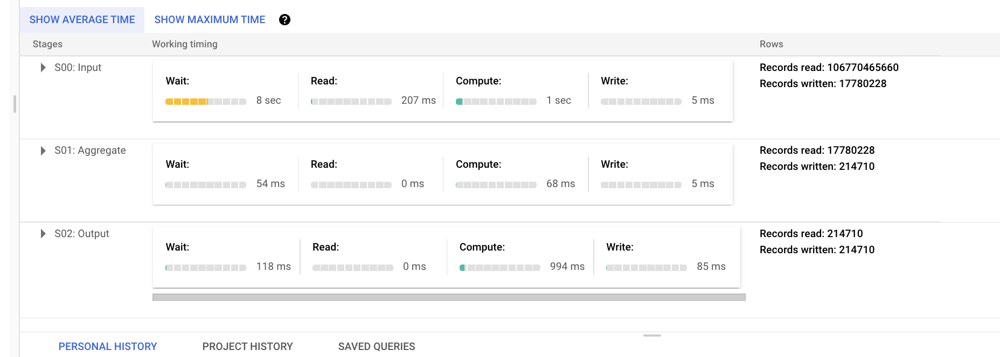

# <https:§§partner.cloudskillsboost.google§course_sessions§221410§video§61492>
> <https://partner.cloudskillsboost.google/course_sessions/221410/video/61492>
        
## Demo:Querying TB of Data in seconds



[https://github.com/GoogleCloudPlatform/training-data-analyst/blob/master/courses/data-engineering/demos/bigquery_scale.md](/https:§§github.com§GoogleCloudPlatform§training-data-analyst§blob§master§courses§data-engineering§demos§bigquery_scale.md/readme.md)

```sql
SELECT
  language,
  title,
  SUM(views) AS views
FROM
  `bigquery-samples.wikipedia_benchmark.Wiki100B`
WHERE
  UPPER(title) LIKE '%GOOG%'
GROUP BY
  language,
  title
ORDER BY
  views DESC;
```



use cmd click to show table info 
shortcuts



```sql
SELECT
hour,
AVG(fare) AS avg_fare
FROM (
  SELECT
  EXTRACT(HOUR
  FROM
  trip_start_timestamp) AS hour,
  fare
  FROM
  `bigquery-public-data.chicago_taxi_trips.taxi_trips` 
  WHERE pickup_community_area = 32
)
GROUP BY hour
ORDER BY avg_fare DESC
```

no idx needed to be managed

resources


stages

