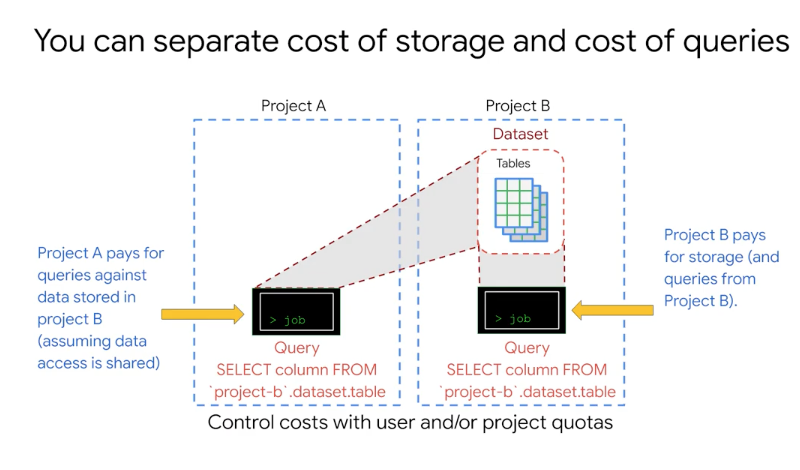

# <https:§§partner.cloudskillsboost.google§course_sessions§221410§video§61493>
> <https://partner.cloudskillsboost.google/course_sessions/221410/video/61493>
        
## Getting Started

dataset in project
use project.dataset.table

help to structure the info logically
separate tables in different anlytical domain
use prj level scoping

billing/security is associate to a project using the query
need iam permission to submit a query job
submit query job to service

cloud iam at dataset level not table level

dataset can be regional and multiregional

table must have schema

all is encrypted
you can use gmail address for access optionally
use cloud iam roles 
permission at dataset level
logs can viewed with stackdriver
you can have table expiration

predefind roles
you can create yours
shared but controlled data
in traditional dwh table level security
in bq use authorized views and row level permissions

all the table in dataset have the same access settings
you can use views to have more granular control
same region/multiregion of dataset
you can def materialized view with autorefresh

bq query service is different from bq storage service
federated queries cretaed tmp tables used to display results
it's stored for 24h and then deleted
query from cache are free
you can save result in a new table

query calculator and estimate cost to check cost
you can have fix prices
slots are for flat plans

public dataset share with all authenticated users
billing go to thie projects even if using public data
1tb free query each month

