# <https:§§partner.cloudskillsboost.google§course_sessions§221410§video§61494>
> <https://partner.cloudskillsboost.google/course_sessions/221410/video/61494>

## Loading Data

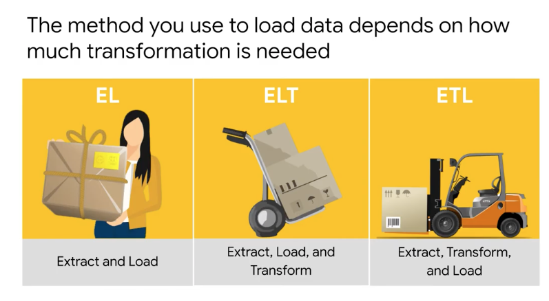
rl =  as it is
elt = loaded into table and tranformed there
etl = transf occurs in other componenet before to be loaded in bq

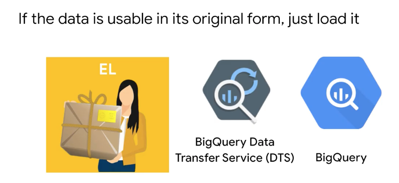
no need for Tr

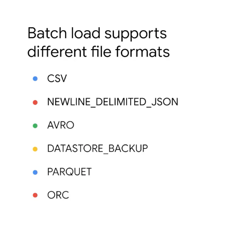
supported files
load job created adestination table iof it does not exists
avro defined the schena automaticaly
json/csv can autodetect schema
data can be appended to tables and no schema needed to be specified
you can use CF to lunch load jons

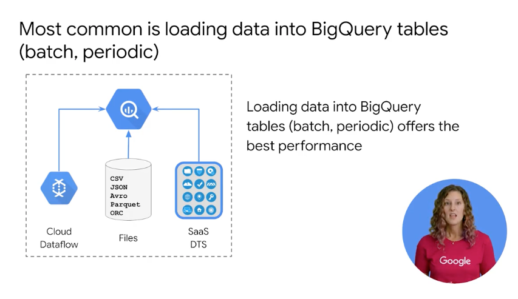
bq can import data using api too
api can be used from app engine cf kubernetics
use cloud dtaflow or cloud data proc 

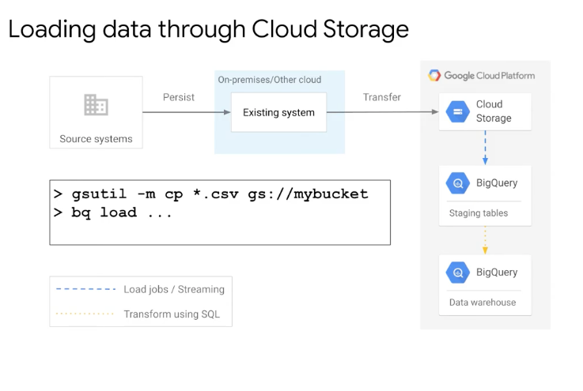
use staging table 

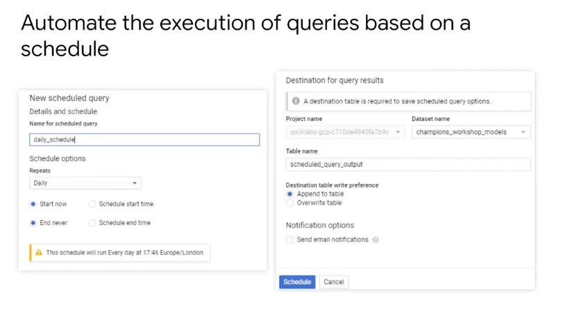
you can schedule query and cache results
use of parametrize

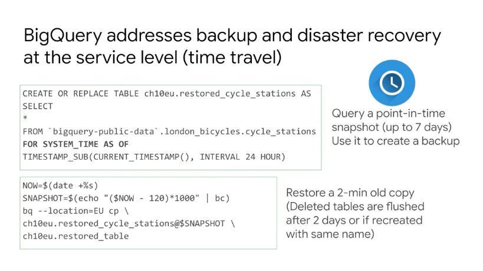
you can restored data for the last 7 days
ex as 24 hours ago

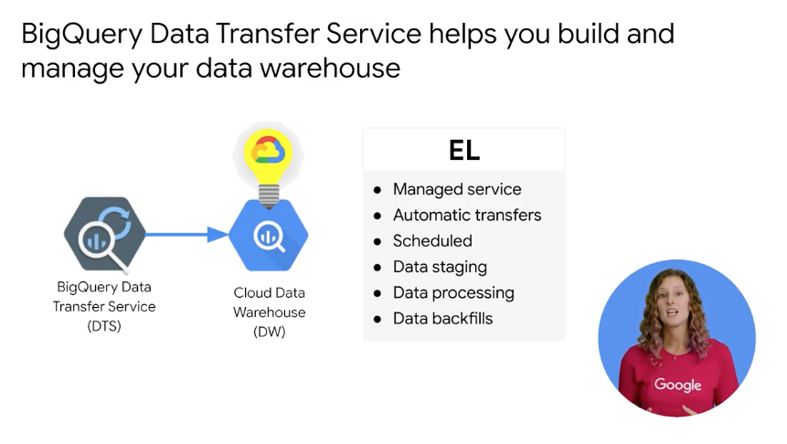
transfer service to import data in bq from existing onpremise
back filling data with no gaps

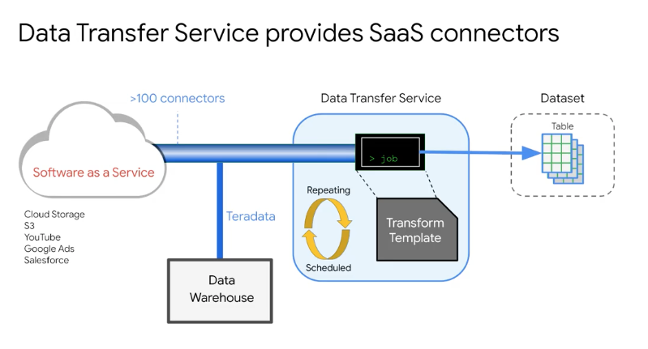
def connectors and scheduled service

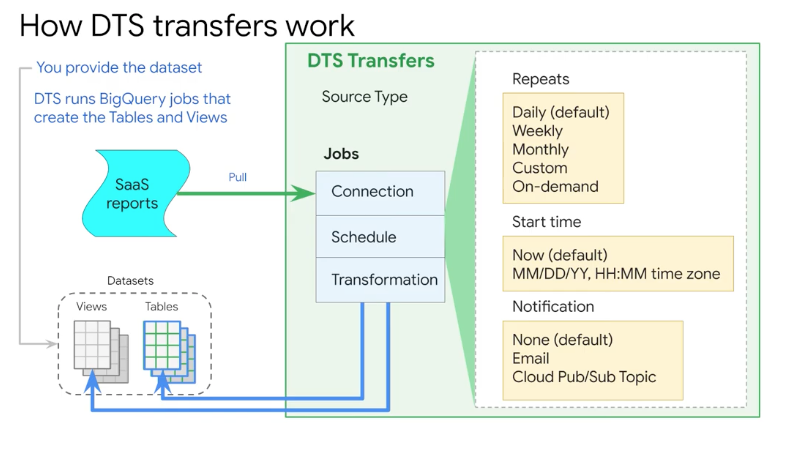
how it works

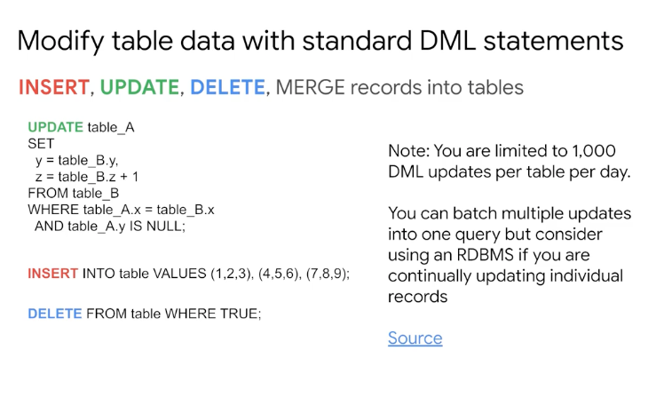
don't use bq as as olap

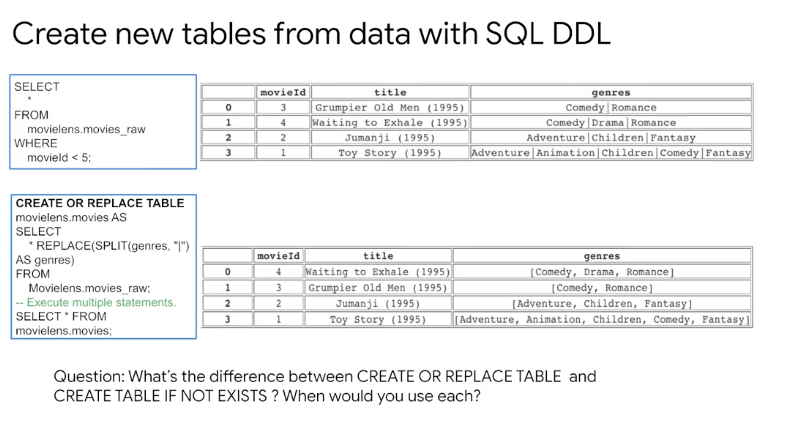

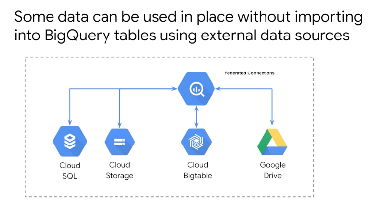
query external table via federated query
no need to import first

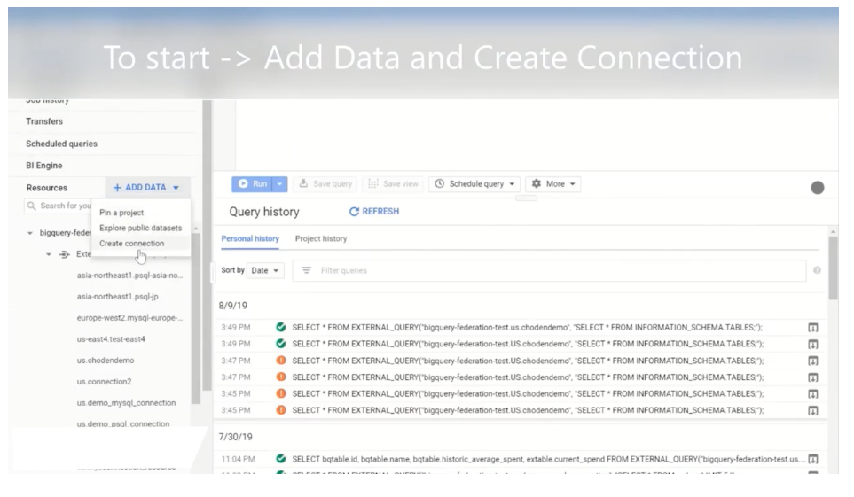
def extrnal connection
EXTERNAL_QUERY

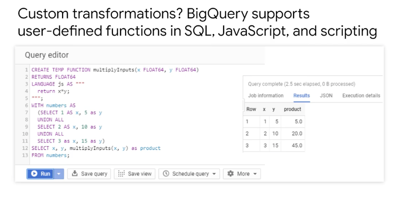
use UDF for specific function
js only supported
use sql if possible

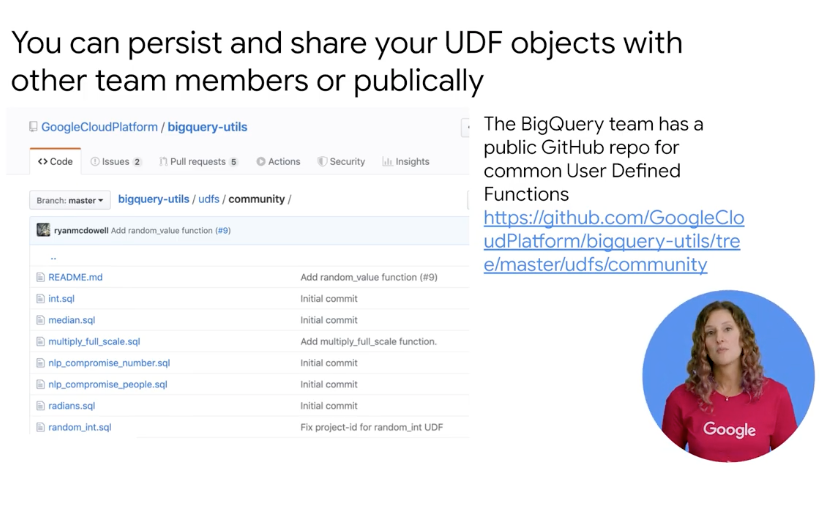
persited udf 

