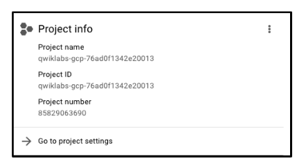
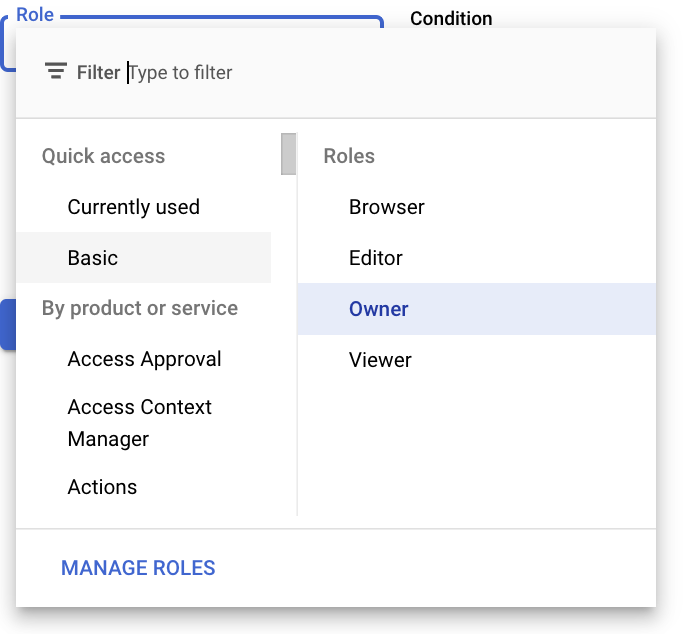

# <https:§§partner.cloudskillsboost.google§focuses§11600>
> <https://partner.cloudskillsboost.google/focuses/11600?parent=catalog>
        
## Projects in the Cloud Console

google prj is an organizing entity 
https://cloud.google.com/docs/overview/#projects

- project name
- project id
- project number

## Roles and permissions

collection sof permissions and roles map to resource policies
https://cloud.google.com/iam/

members list
role column : editor, owner ....

## APIs and services

Google Cloud APIs are a key part of Google Cloud. Like services, the 200+ APIs, in areas
that range from business administration to machine learning, all easily integrate with
Google Cloud projects and applications