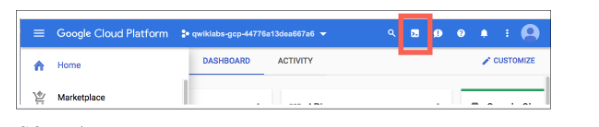
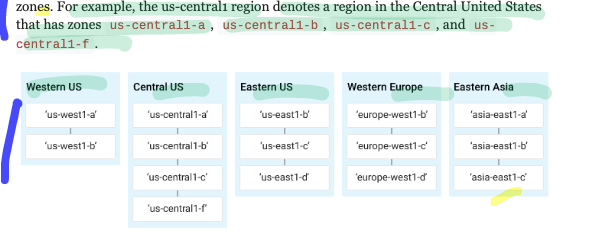
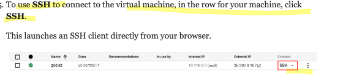
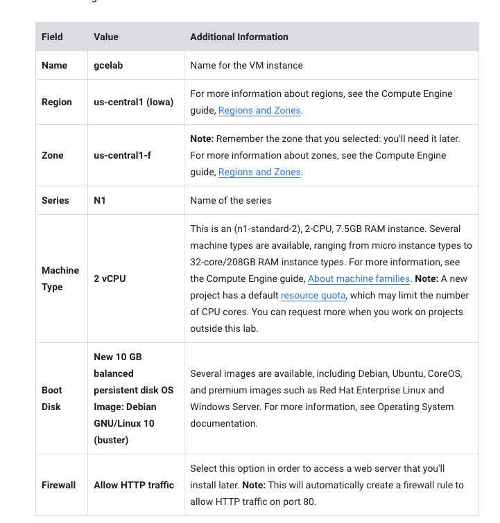

# <https:§§partner.cloudskillsboost.google§focuses§11602>
> <https://partner.cloudskillsboost.google/focuses/11602>
   
## Activate Cloud Shell



```bash
# list active account (user/service)
gcloud auth list

# list project if
gcloud config list project

```

https://cloud.google.com/sdk/gcloud

## Understanding Regions and Zones

resource ive in regions and zones


https://cloud.google.com/compute/docs/regions-zones/

## Task 1: Create a new instance from the Cloud Console

- nav - compute engibe - vm instances - create instance
  params
- name
- region
- zone
- series
- machine types
- boot disk
- firewall



## Task 1. Create a new instance from the Cloud Console

 Navigation menu (Navigation menu icon), click Compute Engine > VM Instances.



## Task 2: Install an NGINX web server

```bash
sudo su -
apt-get update
apt-get install nginx -y
```

check external ip

## Task 3: Create a new instance with gcloud

```bash
# create a new vm instance
gcloud compute instances create gcelab2 --machine-type n1-standard-2 --zone us-central1-f

# help
gcloud compute instances create --help

# ssh
gcloud compute ssh gclebal2 --zone us-central1-f

```
