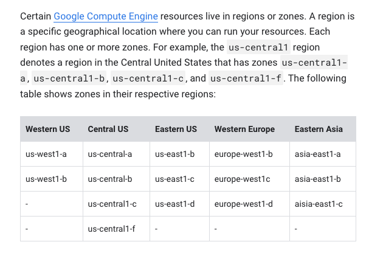
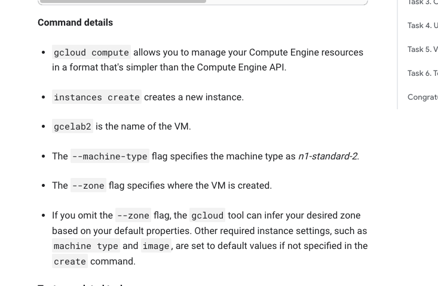

# <https:§§partner.cloudskillsboost.google§focuses§11603>
> <https://partner.cloudskillsboost.google/focuses/11603>
        
Getting Started with Cloud Shell and gcloud

## Task 1. Configure your environment

https://cloud.google.com/compute/docs/instances



https://cloud.google.com/compute/docs/regions-zones/

```bash
gcloud config set compute/region us-central1
gcloud config get-value compute/region
gcloud config set compute/zone us-central1-b
gcloud config get-value compute/zone

gcloud config get-value project
gcloud compute project-info describe --project $(gcloud config get-value project) 
```

```bash
# set env var
export PROJECT_ID=$(gcloud config get-value project)
export ZONE=$(gcloud config get-value compute/zone)

echo -e "PROJECT ID: $PROJECT_ID\nZONE: $ZONE"
```

```bash
gcloud compute instances create gcelab2 --machine-type n1-standard-2 --zone $ZONE
```



```
gcloud -h
gcloud config --help 

gcloud config list
gcloud config list --all

gcloud components list
```

## Task 2. Filtering command line output

```bash
gcloud compute instances list
gcloud compute instances list --filter="name=('gcelab2')"

gcloud compute firewall-rules list
gcloud compute firewall-rules list --filter="network='default'"
```

## Task 3. Connecting to your VM instance

```
gcloud compute ssh gcelab2 --zone $ZONE
```


## Task 4. Updating the Firewall

```bash
gcloud compute firewall-rules list

# add tag
gcloud compute instances add-tags gcelab2 --tags http-server,https-server

# update firewall rule
gcloud compute firewall-rules create default-allow-http --direction=INGRESS --priority=1000 --network=default --action=ALLOW --rules=tcp:80 --source-ranges=0.0.0.0/0 --target-tags=http-server

# update rules for the project
gcloud compute firewall-rules list --filter=ALLOW:'80'

# verify communication
curl http://$(gcloud compute instances list --filter=name:gcelab2 --format='value(EXTERNAL_IP)')
```

## Task 5. Viewing the system logs

```bash
gcloud logging logs list 

# view logs for a resource
gcloud logging logs list --filter="compute" 

# for a resource type
gcloud logging read "resource.type=gce_instance" --limit 5

# for specific vm
gcloud logging read "resource.type=gce_instance AND labels.instance_name='gcelab2'" --limit 5
```