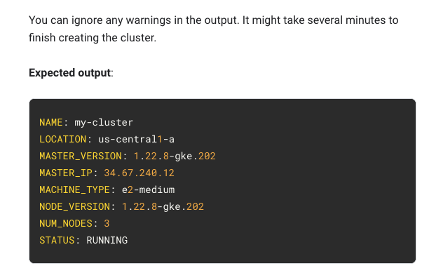
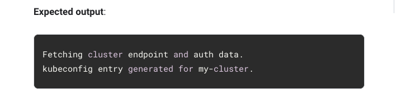
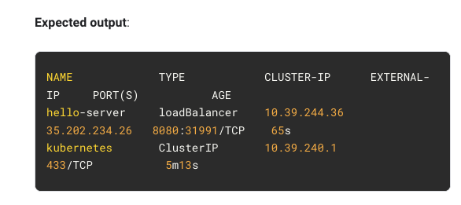

# <https:§§partner.cloudskillsboost.google§focuses§11605>
> <https://partner.cloudskillsboost.google/focuses/11605>
        
Kubernetes Engine: Qwik Start

https://cloud.google.com/compute/docs/load-balancing-and-autoscaling
https://cloud.google.com/kubernetes-engine/docs/concepts/node-pools
https://cloud.google.com/kubernetes-engine/docs/concepts/cluster-autoscaler
https://cloud.google.com/kubernetes-engine/docs/how-to/node-auto-upgrades
https://cloud.google.com/kubernetes-engine/docs/how-to/node-auto-repair
https://cloud.google.com/stackdriver/docs/solutions/gke

## Task 1. Set a default compute zone

```
gcloud config set compute/zone us-central1-a
```

## Task 2. Create a GKE cluster

https://cloud.google.com/kubernetes-engine/docs/concepts/cluster-architecture

```
# create a gke cluster
gcloud container clusters create [CLUSTER-NAME]
```



## Task 3. Get authentication credentials for the cluster

```
gcloud container clusters get-credentials [CLUSTER-NAME]
```


## Task 4. Deploy an application to the cluster

https://kubernetes.io/docs/concepts/workloads/controllers/deployment/
https://kubernetes.io/docs/concepts/services-networking/service/

```
# new deployment
kubectl create deployment hello-server --image=gcr.io/google-samples/hello-app:1.0

# new kube service
kubectl expose deployment hello-server --type=LoadBalancer --port 8080
```
```
# inspect 
kubectl get service
```


## Task 5. Deleting the cluster

```
gcloud container clusters delete [CLUSTER-NAME]
```