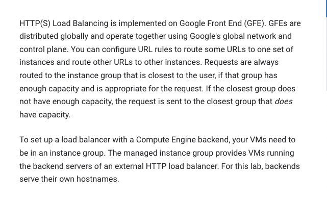
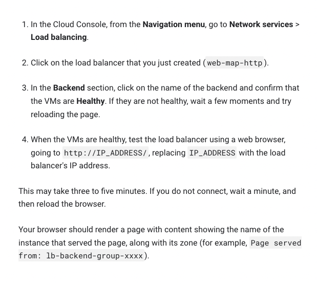

# <https:§§partner.cloudskillsboost.google§focuses§11606>
> <https://partner.cloudskillsboost.google/focuses/11606>
        
Set Up Network and HTTP Load Balancers

 
## Task 1: Set the default region and zone for all resources
```bash
gcloud config set compute/zone us-central1-a
gcloud config set compute/region us-central
```

## Task 2: Create multiple web server instances

define vm instance with apache to run we server request

```bash
# Create three new virtual machines in your default zone and give them all the same tag.

gcloud compute instances create www1 \
  --image-family debian-9 \
  --image-project debian-cloud \
  --zone us-central1-a \
  --tags network-lb-tag \
  --metadata startup-script="#! /bin/bash
    sudo apt-get update
    sudo apt-get install apache2 -y
    sudo service apache2 restart
    echo '<!doctype html><html><body><h1>www1</h1></body></html>' | tee /var/www/html/index.html"

    gcloud compute instances create www2 \
  --image-family debian-9 \
  --image-project debian-cloud \
  --zone us-central1-a \
  --tags network-lb-tag \
  --metadata startup-script="#! /bin/bash
    sudo apt-get update
    sudo apt-get install apache2 -y
    sudo service apache2 restart
    echo '<!doctype html><html><body><h1>www2</h1></body></html>' | tee /var/www/html/index.html"

    gcloud compute instances create www3 \
  --image-family debian-9 \
  --image-project debian-cloud \
  --zone us-central1-a \
  --tags network-lb-tag \
  --metadata startup-script="#! /bin/bash
    sudo apt-get update
    sudo apt-get install apache2 -y
    sudo service apache2 restart
    echo '<!doctype html><html><body><h1>www3</h1></body></html>' | tee /var/www/html/index.html"

# firewall rule
gcloud compute firewall-rules create www-firewall-network-lb \
    --target-tags network-lb-tag --allow tcp:80

# test
gcloud compute instances list
curl http://[IP_ADDRESS]
```

## Task 3: Configure the load balancing service
```bash
# Create a static external IP address for your load balancer:
 
gcloud compute addresses create network-lb-ip-1 \
 --region us-central1

use load balancing service 
https://cloud.google.com/load-balancing/docs/network
# legacy http health check
gcloud compute http-health-checks create basic-check

# target pool
gcloud compute target-pools create www-pool \
    --region us-central1 --http-health-check basic-check

# fwd rule
gcloud compute forwarding-rules create www-rule \
    --region us-central1 \
    --ports 80 \
    --address network-lb-ip-1 \
    --target-pool www-pool
 ```

## Task 4: Sending traffic to your instances

Now that the load balancing service is configured, you can start sending traffic to the forwarding rule and watch the traffic be dispersed to different instances.

```
gcloud compute forwarding-rules describe www-rule --region us-central1
while true; do curl -m1 IP_ADDRESS; done
```

## Task 5: Create an HTTP load balancer


```
gcloud compute instance-templates create lb-backend-template \
   --region=us-central1 \
   --network=default \
   --subnet=default \
   --tags=allow-health-check \
   --image-family=debian-9 \
   --image-project=debian-cloud \
   --metadata=startup-script='#! /bin/bash
     apt-get update
     apt-get install apache2 -y
     a2ensite default-ssl
     a2enmod ssl
     vm_hostname="$(curl -H "Metadata-Flavor:Google" \
     http://169.254.169.254/computeMetadata/v1/instance/name)"
     echo "Page served from: $vm_hostname" | \
     tee /var/www/html/index.html
     systemctl restart apache2'
```

https://cloud.google.com/compute/docs/instance-groups

```bash
# create managed gruop
gcloud compute instance-groups managed create lb-backend-group \
   --template=lb-backend-template --size=2 --zone=us-central1-a

# Create the fw-allow-health-check firewall rule
gcloud compute firewall-rules create fw-allow-health-check \
    --network=default \
    --action=allow \
    --direction=ingress \
    --source-ranges=130.211.0.0/22,35.191.0.0/16 \
    --target-tags=allow-health-check \
    --rules=tcp:80

# setup gloabl static ext IP address
gcloud compute addresses create lb-ipv4-1 \
    --ip-version=IPV4 \
    --global

gcloud compute addresses describe lb-ipv4-1 \
    --format="get(address)" \
    --global

# health check
gcloud compute health-checks create http http-basic-check \
    --port 80
```
https://cloud.google.com/load-balancing/docs/health-checks

```bash
# Create a backend service:

gcloud compute backend-services create web-backend-service \
    --protocol=HTTP \
    --port-name=http \
    --health-checks=http-basic-check \
    --global
 
# Add your instance group as the backend to the backend service:

gcloud compute backend-services add-backend web-backend-service \
    --instance-group=lb-backend-group \
    --instance-group-zone=us-central1-a \
    --global
 
# Create a URL map to route the incoming requests to the default backend service:

gcloud compute url-maps create web-map-http \
    --default-service web-backend-service
 
# target htoo proxy
gcloud compute target-http-proxies create http-lb-proxy \
    --url-map web-map-http

# gloabl fwd rule
gcloud compute forwarding-rules create http-content-rule \
    --address=lb-ipv4-1\
    --global \
    --target-http-proxy=http-lb-proxy \
    --ports=80
```
https://cloud.google.com/load-balancing/docs/using-forwarding-rules

## Task 6: Testing traffic sent to your instances

