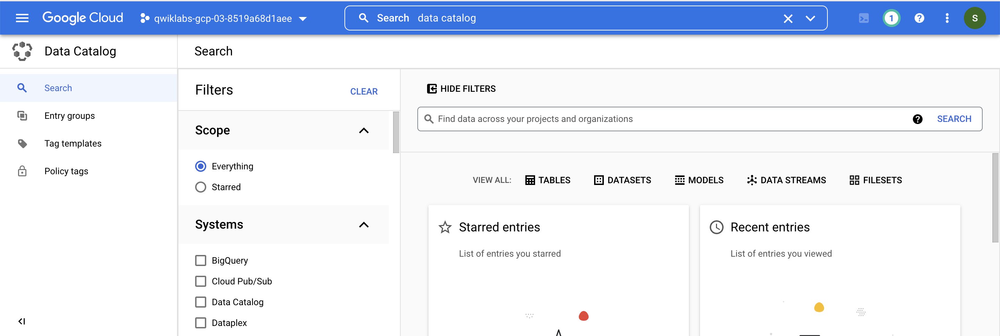
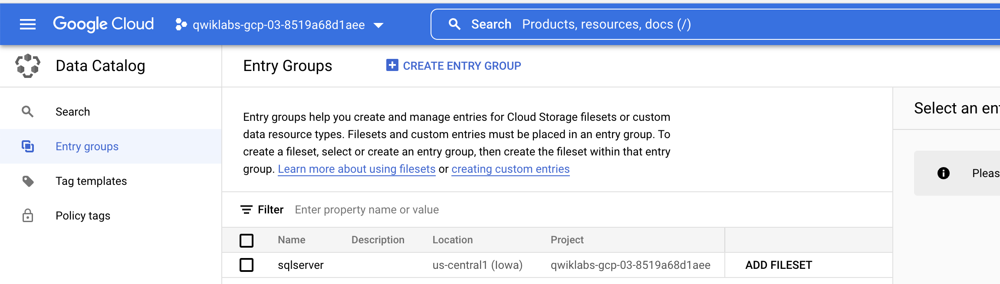
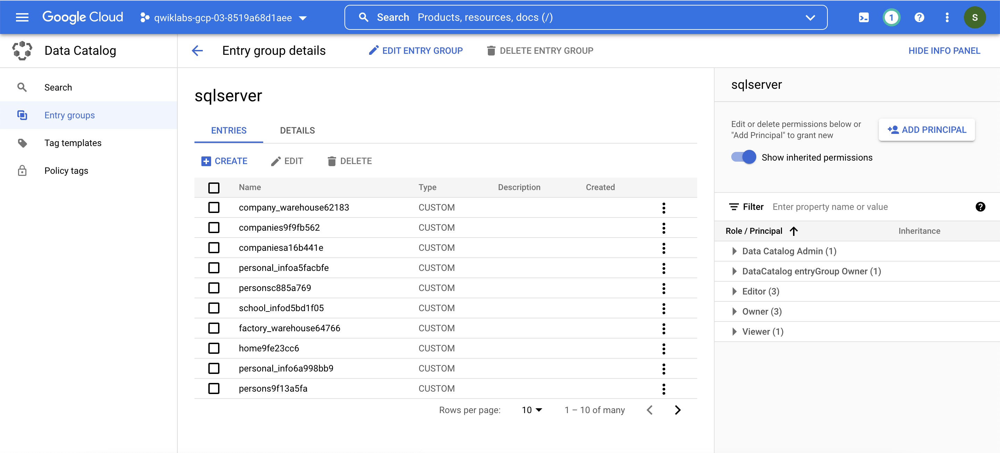
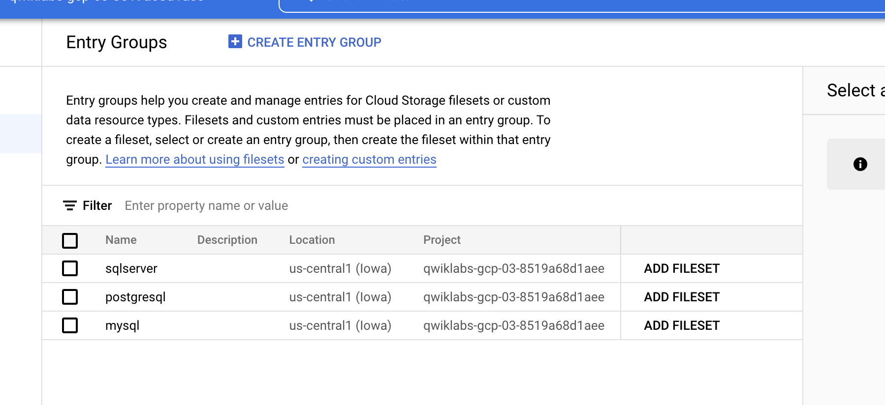

# <https:§§www.cloudskillsboost.google§focuses§11999>
> <https://www.cloudskillsboost.google/focuses/11999>

```bash   
export PROJECT_ID=$(gcloud config get-value project)
```

## create sqlserver db
```bash
gsutil cp gs://spls/gsp814/cloudsql-sqlserver-tooling.zip .
unzip cloudsql-sqlserver-tooling.zip
```

## Set Up the Service Account
```bash
gcloud iam service-accounts create sqlserver2dc-credentials \
--display-name  "Service Account for SQLServer to Data Catalog connector" \
--project $PROJECT_ID

gcloud iam service-accounts keys create "sqlserver2dc-credentials.json" \
--iam-account "sqlserver2dc-credentials@$PROJECT_ID.iam.gserviceaccount.com"

gcloud projects add-iam-policy-binding $PROJECT_ID \
--member "serviceAccount:sqlserver2dc-credentials@$PROJECT_ID.iam.gserviceaccount.com" \
--quiet \
--project $PROJECT_ID \
--role "roles/datacatalog.admin"

```

## Execute SQLServer to Data Catalog connector.

[https://github.com/GoogleCloudPlatform/datacatalog-connectors-rdbms/tree/master/google-datacatalog-sqlserver-connector](/https:§§github.com§GoogleCloudPlatform§datacatalog-connectors-rdbms§tree§master§google-datacatalog-sqlserver-connector/readme.md)


```bash
cd infrastructure/terraform/

public_ip_address=$(terraform output -raw public_ip_address)
username=$(terraform output -raw username)
password=$(terraform output -raw password)
database=$(terraform output -raw db_name)

cd ~/cloudsql-sqlserver-tooling

docker run --rm --tty -v \
"$PWD":/data mesmacosta/sqlserver2datacatalog:stable \
--datacatalog-project-id=$PROJECT_ID \
--datacatalog-location-id=us-central1 \
--sqlserver-host=$public_ip_address \
--sqlserver-user=$username \
--sqlserver-pass=$password \
--sqlserver-database=$database
```

## Search for the SQLServer Entries in Data Catalog





contents



....


