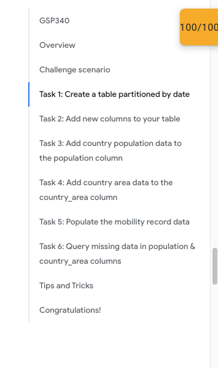

# <https:§§www.cloudskillsboost.google§focuses§14341>
> <https://www.cloudskillsboost.google/focuses/14341

## Task 1: Create a table partitioned by date
```sql
CREATE OR REPLACE TABLE
  covid_383.oxford_policy_tracker_905
PARTITION BY
  date OPTIONS ( partition_expiration_days=360) AS
SELECT
  *
FROM
  `bigquery-public-data.covid19_govt_response.oxford_policy_tracker`
WHERE
  alpha_3_code NOT IN ('USA','GBR',
    'BRA',
    'CAN')
```

...
## 5

```sql
UPDATE
  covid_383.oxford_policy_tracker_905 t0
SET
  t0.mobility.avg_retail = t2.avg_retail,
  t0.mobility.avg_grocery = t2.avg_grocery,
  t0.mobility.avg_parks = t2.avg_parks,
  t0.mobility.avg_transit = t2.avg_transit,
  t0.mobility.avg_workplace = t2.avg_workplace,
  t0.mobility.avg_residential = t2.avg_residential
FROM (
  SELECT
    country_region,
    date,
    AVG(retail_and_recreation_percent_change_from_baseline) AS avg_retail,
    AVG(grocery_and_pharmacy_percent_change_from_baseline) AS avg_grocery,
    AVG(parks_percent_change_from_baseline) AS avg_parks,
    AVG(transit_stations_percent_change_from_baseline) AS avg_transit,
    AVG( workplaces_percent_change_from_baseline ) AS avg_workplace,
    AVG( residential_percent_change_from_baseline) AS avg_residential
  FROM
    `bigquery-public-data.covid19_google_mobility.mobility_report`
  GROUP BY
    country_region,
    date) AS t2
WHERE
  t0.country_name = t2.country_region
  AND t0.date = t2.date
```
## 6
```sql
select distinct country_name 
from  covid_383.oxford_policy_tracker_905
where population is null
union all 
select distinct country_name 
from  covid_383.oxford_policy_tracker_905
where country_area is null
order by country_name
```

:)

