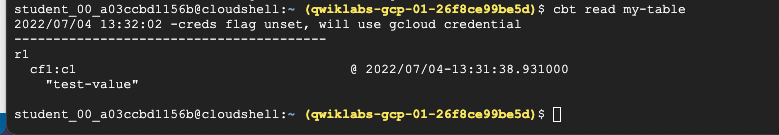

# <https:§§www.cloudskillsboost.google§games§2854§labs§17205>
> <https://www.cloudskillsboost.google/games/2854/labs/17205>
        
## Task 1. Create a Cloud Bigtable instance


```
echo project = `gcloud config get-value project` > ~/.cbtrc
echo instance = quickstart-instance >> ~/.cbtrc
```

Cloud Bigtable stores data in tables, which contain rows. Each row is identified by a row key.

Data in a row is organized into column families, or groups of columns. A column qualifier identifies a single column within a column family.

A cell is the intersection of a row and a column. Each cell can contain multiple versions of a value.

```
cbt createtable my-table
cbt ls
```
```
cbt createfamily my-table cf1
```





