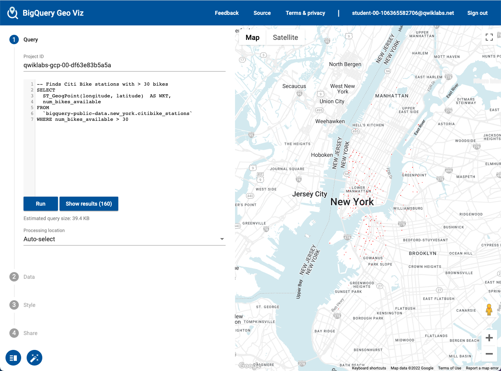
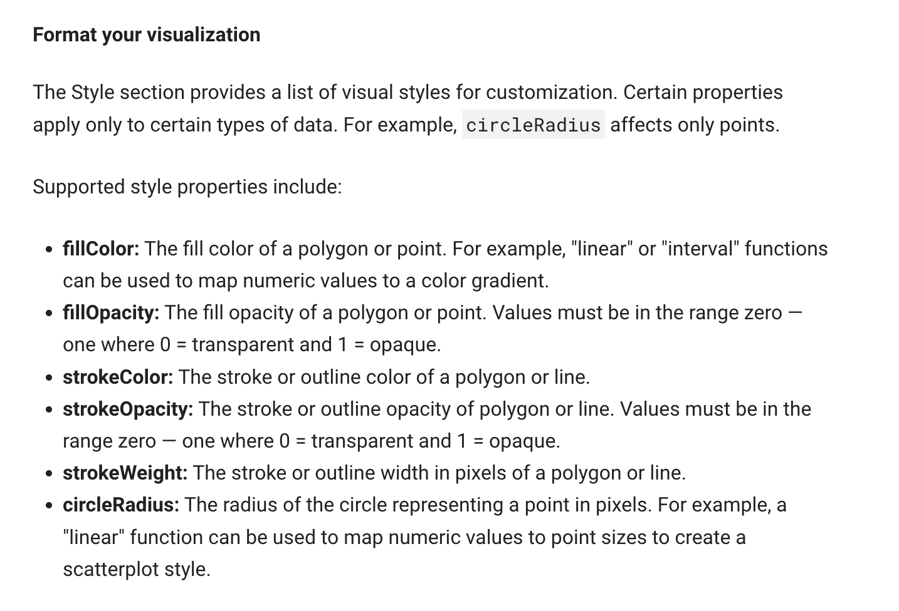
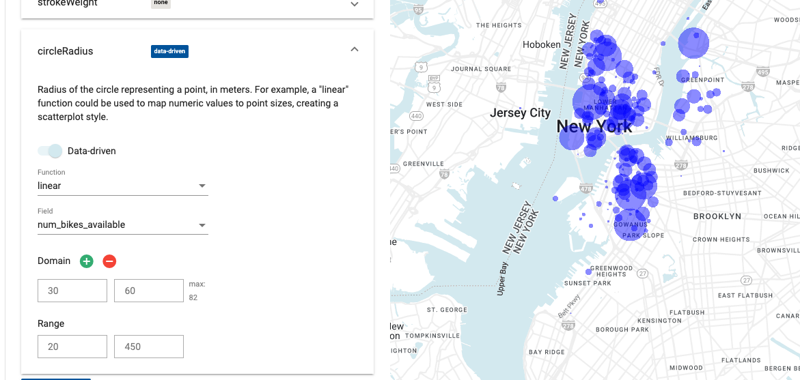

# <https:§§www.cloudskillsboost.google§games§2854§labs§17210>
> <https://www.cloudskillsboost.google/games/2854/labs/17210>
        

```
-- Finds Citi Bike stations with > 30 bikes
SELECT
  ST_GeogPoint(longitude, latitude)  AS WKT,
  num_bikes_available
FROM
  `bigquery-public-data.new_york.citibike_stations`
WHERE num_bikes_available > 30
```

https://bigquerygeoviz.appspot.com/







