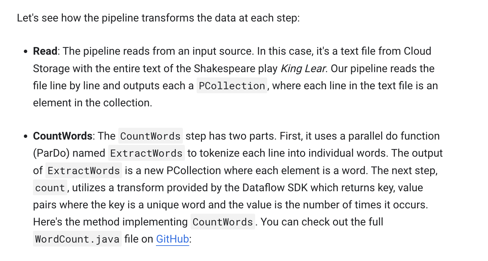
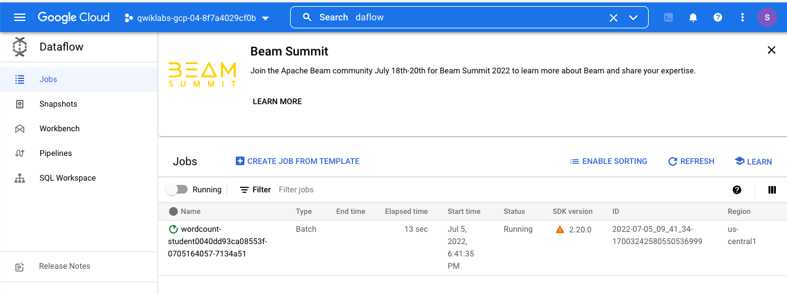
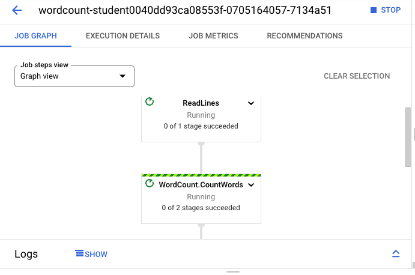

# <https:§§www.cloudskillsboost.google§games§2854§labs§17211>
> <https://www.cloudskillsboost.google/games/2854/labs/17211>
Run a Big Data Text Processing Pipeline in Cloud Dataflow

```
mvn archetype:generate \
      -DarchetypeGroupId=org.apache.beam \
      -DarchetypeArtifactId=beam-sdks-java-maven-archetypes-examples \
      -DarchetypeVersion=2.20.0 \
      -DgroupId=org.example \
      -DartifactId=first-dataflow \
      -Dversion="0.1" \
      -Dpackage=org.apache.beam.examples \
      -DinteractiveMode=false
```

```
echo $DEVSHELL_PROJECT_ID
```

```
 mvn -Pdataflow-runner compile exec:java \
      -Dexec.mainClass=org.apache.beam.examples.WordCount \
      -Dexec.args="--project=${PROJECT_ID} \
      --stagingLocation=gs://${BUCKET_NAME}/staging/ \
      --output=gs://${BUCKET_NAME}/output \
      --runner=DataflowRunner"
```





wc execution


