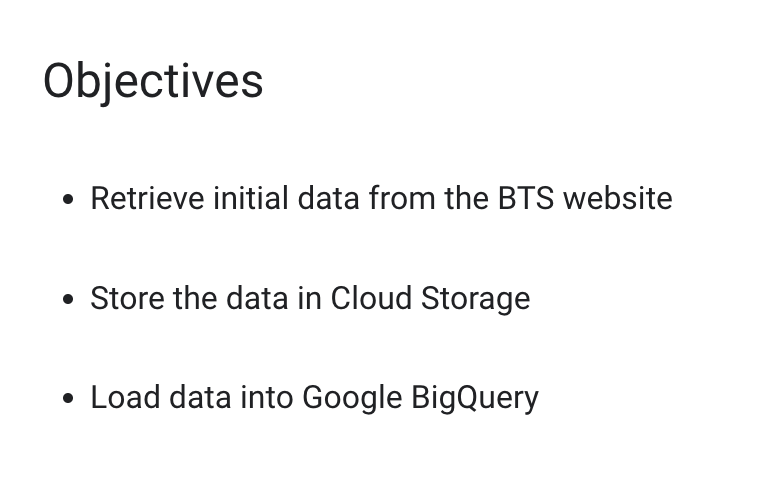
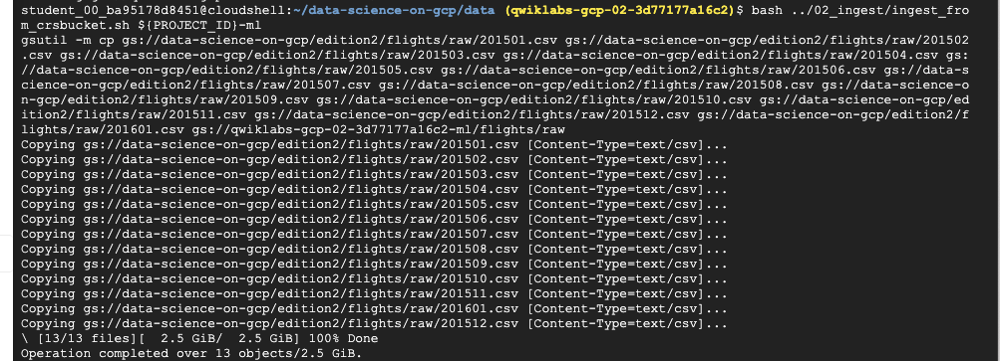
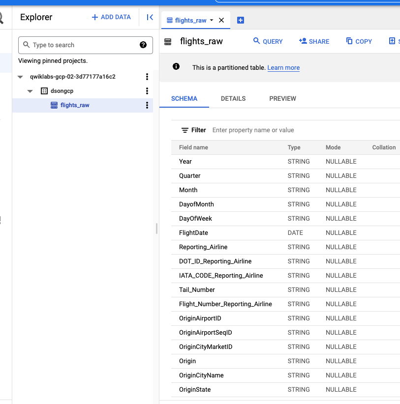

# <https:§§www.cloudskillsboost.google§games§2854§labs§17212>
> <https://www.cloudskillsboost.google/games/2854/labs/17212>
        


## Task 1. Prepare your environment

```
git clone \
   https://github.com/GoogleCloudPlatform/data-science-on-gcp/
```

## Task 2. Retrieve data from a website

```bash
curl https://www.bts.dot.gov/sites/bts.dot.gov/files/docs/legacy/additional-attachment-files/ONTIME.TD.201501.REL02.04APR2015.zip --output data.zip
```

```bash
#!/bin/bash

if [ "$#" -ne 1 ]; then
    echo "Usage: ./ingest_from_crsbucket.sh  destination-bucket-name"
    exit
fi

BUCKET=$1
FROM=gs://data-science-on-gcp/edition2/flights/raw
TO=gs://$BUCKET/flights/raw

CMD="gsutil -m cp "
for MONTH in `seq -w 1 12`; do
  CMD="$CMD ${FROM}/2015${MONTH}.csv"
done
CMD="$CMD ${FROM}/201601.csv $TO"

echo $CMD
$CMD

```

get data
```bash
export PROJECT_ID=$(gcloud info --format='value(config.project)')
gsutil mb -l us-central1 gs://${PROJECT_ID}-ml

bash ../02_ingest/ingest_from_crsbucket.sh ${PROJECT_ID}-ml
```



## Task 3. Load data into Google BigQuery

```bash
#!/bin/bash

if [ "$#" -ne 2 ]; then
    echo "Usage: ./bqload.sh  csv-bucket-name YEAR"
    exit
fi

BUCKET=$1
YEAR=$2

SCHEMA=Year:STRING,Quarter:STRING,Month:STRING,DayofMonth:STRING,DayOfWeek:STRING,FlightDate:DATE,Reporting_Airline:STRING,DOT_ID_Reporting_Airline:STRING,IATA_CODE_Reporting_Airline:STRING,Tail_Number:STRING,Flight_Number_Reporting_Airline:STRING,OriginAirportID:STRING,OriginAirportSeqID:STRING,OriginCityMarketID:STRING,Origin:STRING,OriginCityName:STRING,OriginState:STRING,OriginStateFips:STRING,OriginStateName:STRING,OriginWac:STRING,DestAirportID:STRING,DestAirportSeqID:STRING,DestCityMarketID:STRING,Dest:STRING,DestCityName:STRING,DestState:STRING,DestStateFips:STRING,DestStateName:STRING,DestWac:STRING,CRSDepTime:STRING,DepTime:STRING,DepDelay:STRING,DepDelayMinutes:STRING,DepDel15:STRING,DepartureDelayGroups:STRING,DepTimeBlk:STRING,TaxiOut:STRING,WheelsOff:STRING,WheelsOn:STRING,TaxiIn:STRING,CRSArrTime:STRING,ArrTime:STRING,ArrDelay:STRING,ArrDelayMinutes:STRING,ArrDel15:STRING,ArrivalDelayGroups:STRING,ArrTimeBlk:STRING,Cancelled:STRING,CancellationCode:STRING,Diverted:STRING,CRSElapsedTime:STRING,ActualElapsedTime:STRING,AirTime:STRING,Flights:STRING,Distance:STRING,DistanceGroup:STRING,CarrierDelay:STRING,WeatherDelay:STRING,NASDelay:STRING,SecurityDelay:STRING,LateAircraftDelay:STRING,FirstDepTime:STRING,TotalAddGTime:STRING,LongestAddGTime:STRING,DivAirportLandings:STRING,DivReachedDest:STRING,DivActualElapsedTime:STRING,DivArrDelay:STRING,DivDistance:STRING,Div1Airport:STRING,Div1AirportID:STRING,Div1AirportSeqID:STRING,Div1WheelsOn:STRING,Div1TotalGTime:STRING,Div1LongestGTime:STRING,Div1WheelsOff:STRING,Div1TailNum:STRING,Div2Airport:STRING,Div2AirportID:STRING,Div2AirportSeqID:STRING,Div2WheelsOn:STRING,Div2TotalGTime:STRING,Div2LongestGTime:STRING,Div2WheelsOff:STRING,Div2TailNum:STRING,Div3Airport:STRING,Div3AirportID:STRING,Div3AirportSeqID:STRING,Div3WheelsOn:STRING,Div3TotalGTime:STRING,Div3LongestGTime:STRING,Div3WheelsOff:STRING,Div3TailNum:STRING,Div4Airport:STRING,Div4AirportID:STRING,Div4AirportSeqID:STRING,Div4WheelsOn:STRING,Div4TotalGTime:STRING,Div4LongestGTime:STRING,Div4WheelsOff:STRING,Div4TailNum:STRING,Div5Airport:STRING,Div5AirportID:STRING,Div5AirportSeqID:STRING,Div5WheelsOn:STRING,Div5TotalGTime:STRING,Div5LongestGTime:STRING,Div5WheelsOff:STRING,Div5TailNum:STRING

# create dataset if not exists
PROJECT=$(gcloud config get-value project)
#bq --project_id $PROJECT rm -f ${PROJECT}:dsongcp.flights_raw
bq --project_id $PROJECT show dsongcp || bq mk --sync dsongcp

for MONTH in `seq -w 1 12`; do

CSVFILE=gs://${BUCKET}/flights/raw/${YEAR}${MONTH}.csv
bq --project_id $PROJECT  --sync \
   load --time_partitioning_field=FlightDate --time_partitioning_type=MONTH \
   --source_format=CSV --ignore_unknown_values --skip_leading_rows=1 --schema=$SCHEMA \
   --replace ${PROJECT}:dsongcp.flights_raw\$${YEAR}${MONTH} $CSVFILE

done

```

bq load
```
bash ../02_ingest/bqload.sh ${PROJECT_ID}-ml 2015
```


