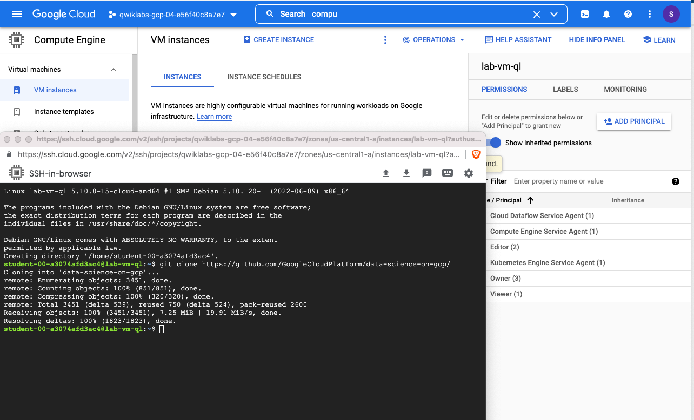
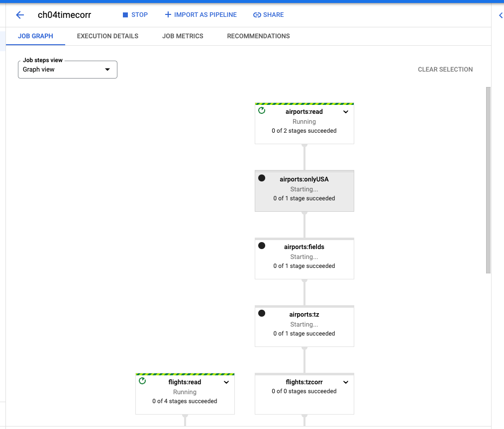
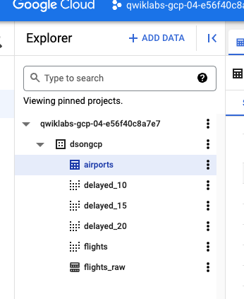
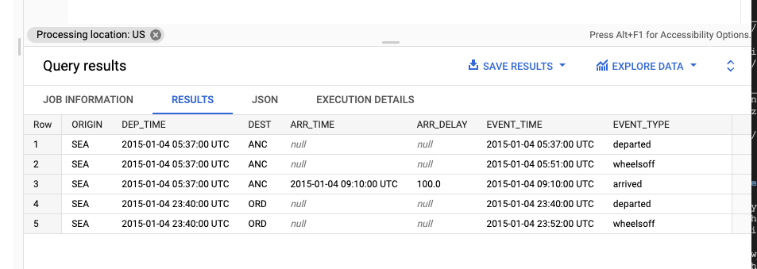

# <https:§§www.cloudskillsboost.google§games§2854§labs§17213>
> <https://www.cloudskillsboost.google/games/2854/labs/17213>
        
Processing Data with Google Cloud Dataflow




```
git clone https://github.com/GoogleCloudPlatform/data-science-on-gcp/
cd ~/data-science-on-gcp/04_streaming/transform
```

```
./05.py
```

```
export PROJECT_ID=$(gcloud info --format='value(config.project)')
export BUCKET=${PROJECT_ID}-ml
./stage_airports_file.sh $BUCKET
./df06.py --project $PROJECT_ID --bucket $BUCKET
```


```
./df07.py -p $PROJECT_ID -b $BUCKET -r us-central1
```



```sql
SELECT
  ORIGIN,
  DEP_TIME,
  DEST,
  ARR_TIME,
  ARR_DELAY,
  EVENT_TIME,
  EVENT_TYPE
FROM
  dsongcp.flights_simevents
WHERE
  (DEP_DELAY > 15 and ORIGIN = 'SEA') or
  (ARR_DELAY > 15 and DEST = 'SEA')
ORDER BY EVENT_TIME ASC
LIMIT
  5
```

