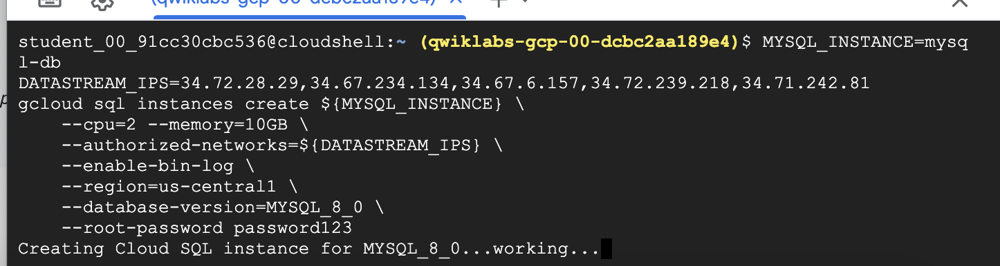
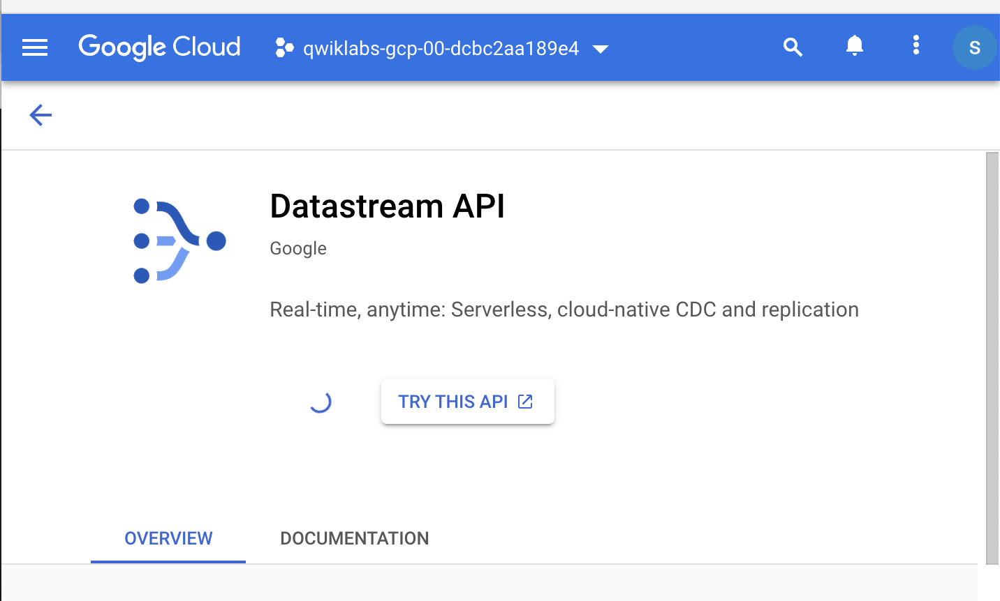
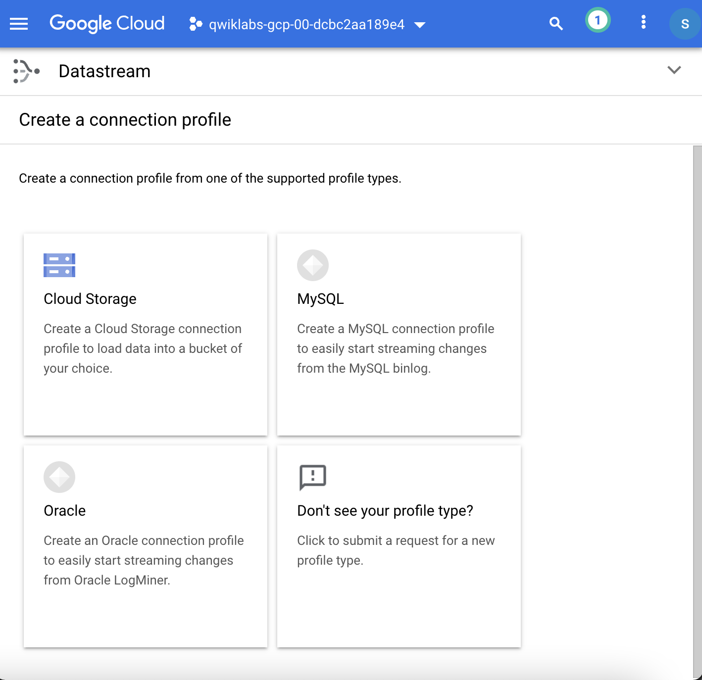
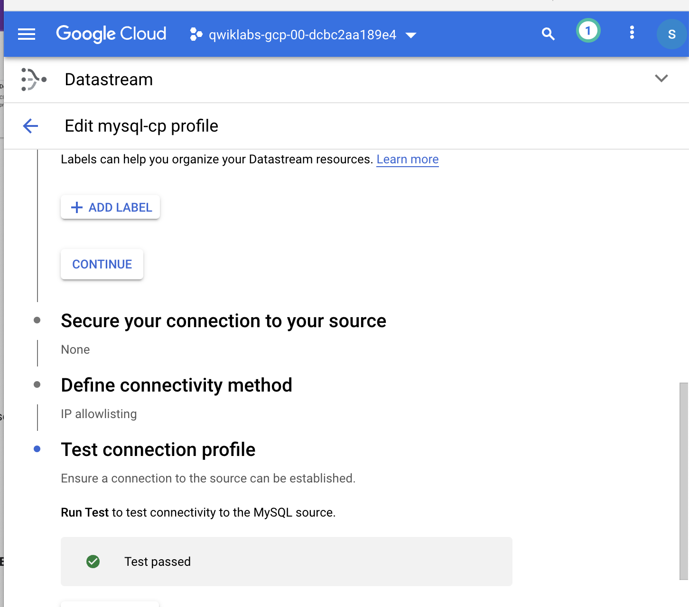
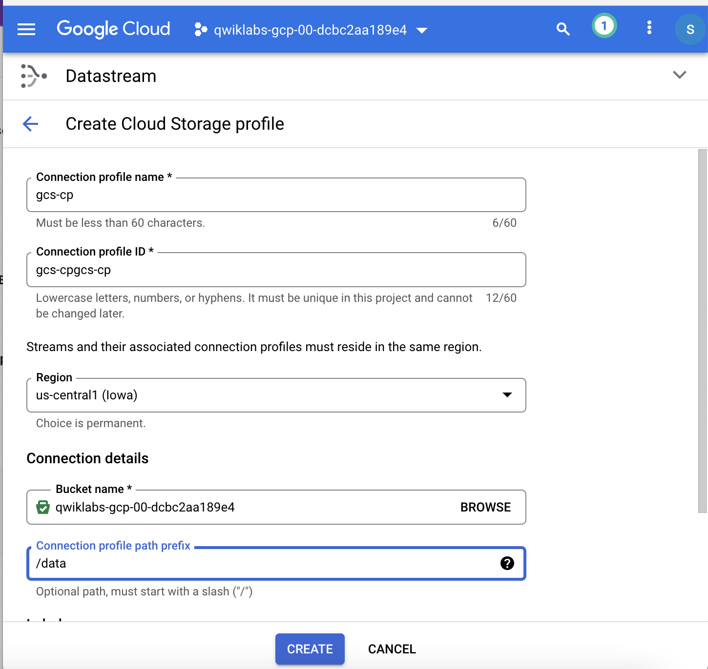
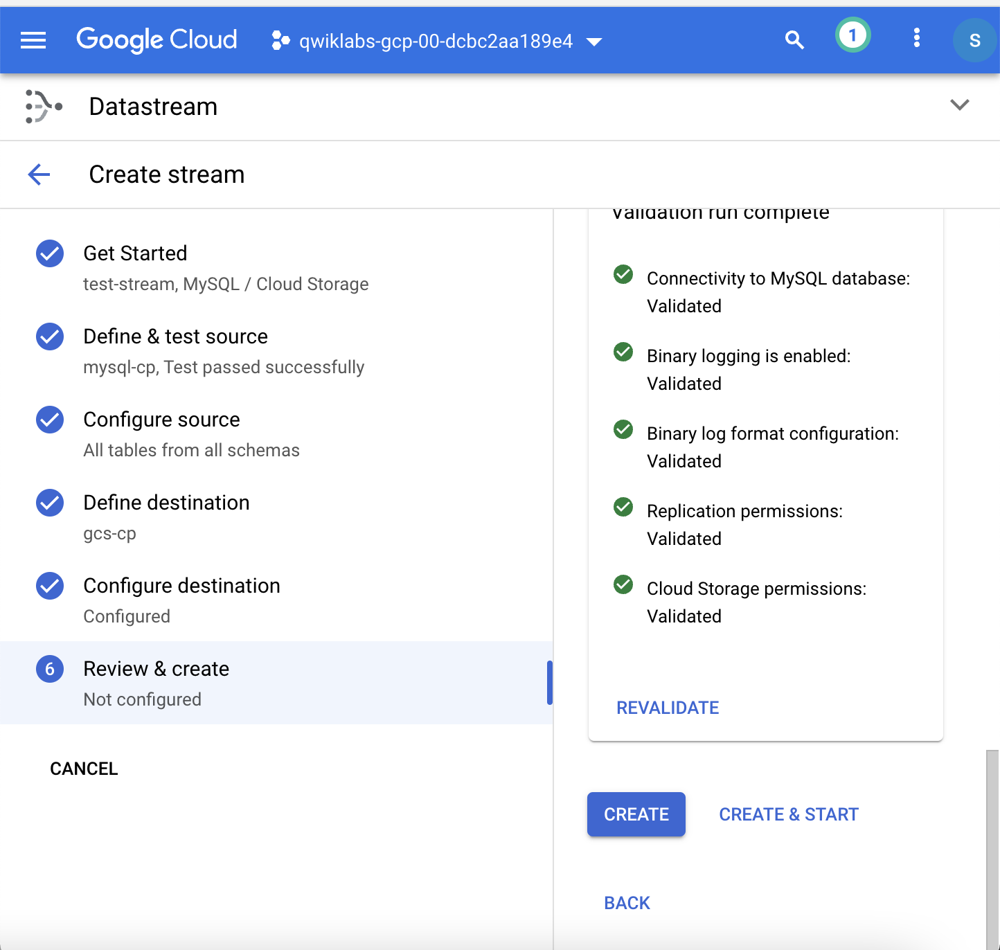
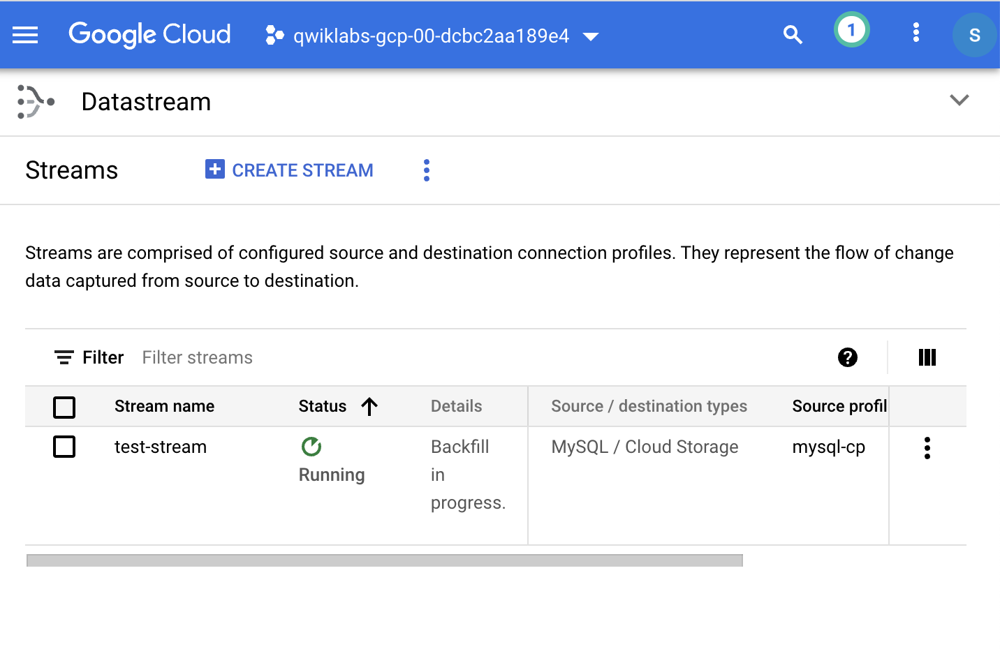
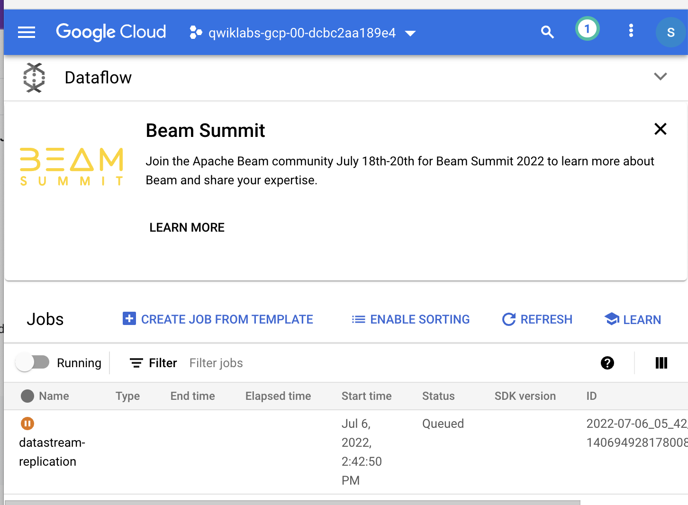

# <https:§§www.cloudskillsboost.google§games§2880§labs§17405>
> <https://www.cloudskillsboost.google/games/2880/labs/17405>
        
Datastream MySQL to BigQuery

```
MYSQL_INSTANCE=mysql-db
DATASTREAM_IPS=34.72.28.29,34.67.234.134,34.67.6.157,34.72.239.218,34.71.242.81
gcloud sql instances create ${MYSQL_INSTANCE} \
    --cpu=2 --memory=10GB \
    --authorized-networks=${DATASTREAM_IPS} \
    --enable-bin-log \
    --region=us-central1 \
    --database-version=MYSQL_8_0 \
    --root-password password123
```


https://cloud.google.com/datastream/docs/ip-allowlists-and-regions

```
gsutil mb gs://${PROJECT_ID}
```

```
gcloud pubsub topics create datastream
gcloud pubsub subscriptions create datastream-subscription --topic=datastream
gsutil notification create -f "json" -p "data/" -t "datastream" "gs://${PROJECT_ID}"
```

```
CREATE DATABASE IF NOT EXISTS test;
USE test;
CREATE TABLE IF NOT EXISTS test.example_table (
id INT NOT NULL AUTO_INCREMENT PRIMARY KEY,
text_col VARCHAR(50),
int_col INT,
created_at TIMESTAMP
);
INSERT INTO test.example_table (text_col, int_col, created_at) VALUES
('hello', 0, '2020-01-01 00:00:00'),
('goodbye', 1, NULL),
('name', -987, NOW()),
('other', 2786, '2021-01-01 00:00:00');
```


```
SERVICE_ACCOUNT=$(gcloud sql instances describe ${MYSQL_INSTANCE} | grep serviceAccountEmailAddress | awk '{print $2;}')
gsutil cp create_mysql.sql gs://${PROJECT_ID}/resources/create_mysql.sql
gsutil iam ch serviceAccount:${SERVICE_ACCOUNT}:objectViewer gs://${PROJECT_ID}
gcloud sql import sql ${MYSQL_INSTANCE} gs://${PROJECT_ID}/resources/create_mysql.sql --quiet
```









## Create the stream





```
bq mk dataset
```

## dataflow job

```bash
gcloud services enable dataflow.googleapis.com
gcloud beta dataflow flex-template run datastream-replication \
        --project="${PROJECT_ID}" --region="us-central1" \
        --template-file-gcs-location="gs://dataflow-templates-us-central1/latest/flex/Cloud_Datastream_to_BigQuery" \
        --enable-streaming-engine \
        --parameters \
inputFilePattern="gs://${PROJECT_ID}/data/",\
gcsPubSubSubscription="projects/${PROJECT_ID}/subscriptions/datastream-subscription",\
outputProjectId="${PROJECT_ID}",\
outputStagingDatasetTemplate="dataset",\
outputDatasetTemplate="dataset",\
outputStagingTableNameTemplate="{_metadata_schema}_{_metadata_table}_log",\
outputTableNameTemplate="{_metadata_schema}_{_metadata_table}",\
deadLetterQueueDirectory="gs://${PROJECT_ID}/dlq/",\
maxNumWorkers=2,\
autoscalingAlgorithm="THROUGHPUT_BASED",\
mergeFrequencyMinutes=2,\
inputFileFormat="avro"
```



