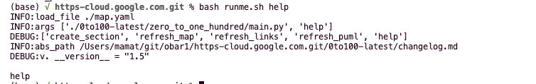

# readme

keep learning what is on https://www.cloudskillsboost.google/  (qwicklabs)

## map
> each folder is about a lab/quest/link 
[`here`](./map.md)

## puml
> each folder is about a lab/quest/link 
[`here`](./readme.puml)
https://chrome.google.com/webstore/detail/plantuml-viewer/legbfeljfbjgfifnkmpoajgpgejojooj

## dependencies

https://github.com/obar1/0to100
to add sections and refresh meta/puml 

## profile
https://www.cloudskillsboost.google/public_profiles/1718b9ef-f099-46f8-9607-356fedc7187e
